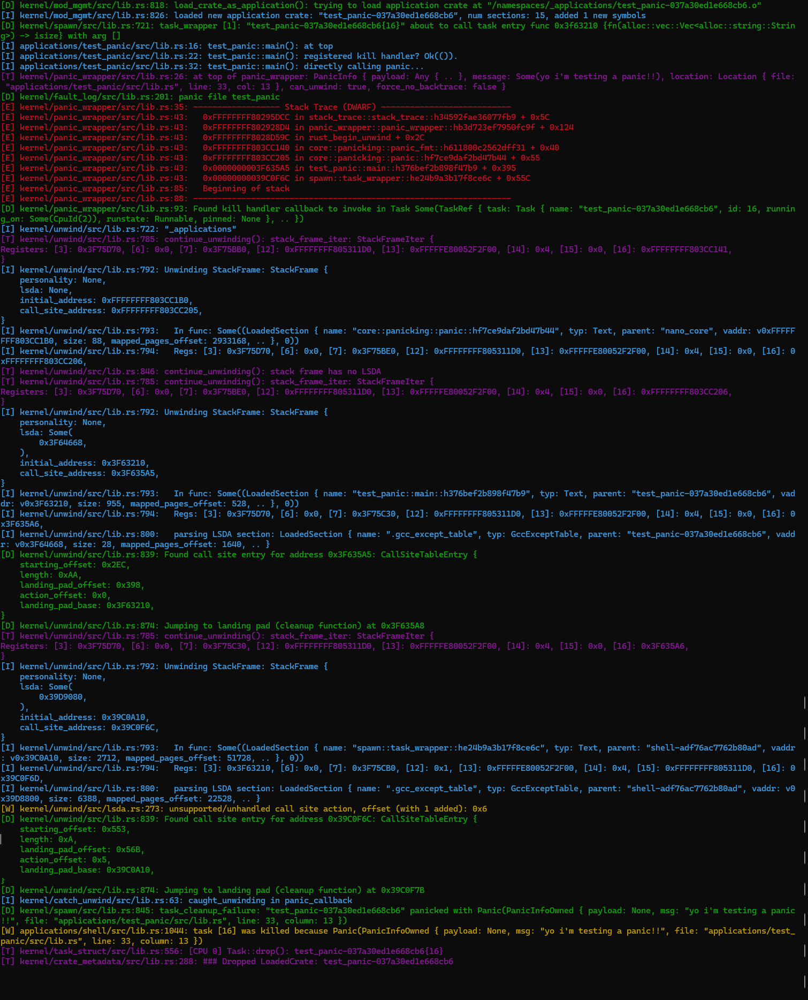
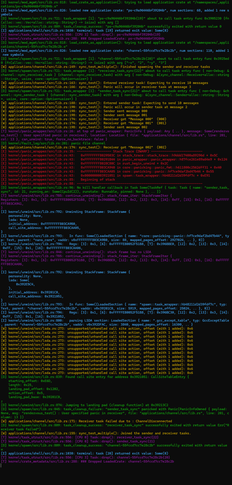

# Tock中的panic

## 在kernel中panic：

- 整个系统就panic了，无法恢复

- 用户实现的panic_handler,panic_fmt函数
- 打印一些基本信息，cpu，正在运行的app等

## 用户态app的panic

- app中的debug_panic crate中的panic_handler函数作为#[panic_handler]

- 通过系统调用exit实现：`TockSyscalls::exit_terminate(ErrorCode::Fail as u32);`

  - errorcode为0或1指示内核退出或重启这个进程

- 内核syscall_handler:

  ```rust
  Syscall::Exit {which,} => match which {
      // The process called the `exit-terminate` system call.
      0 => process.terminate(Some(completion_code as u32)),
      // The process called the `exit-restart` system call.
      1 => process.try_restart(Some(completion_code as u32)),
  }
  ```

  - `terminate`:remove正在运行的task(upcalls);重置grant区域的指针，设置进程状态为teriminated
  - `restart` ：先将进程terminate，再将进程状态设置为yiedled

- terminate后系统正常运行
- capsule和kernel的fault isolation仅通过rust类型系统实现，除此之外若在运行时panic，没有错误恢复机制，整个系统将panic，需要重启。
- 用户态app以正常os的process形式存在，panic时可以选择terminate或是restart。

## MPU

[MPU如何实现内存保护？ (qq.com)](https://mp.weixin.qq.com/s/YhPfC2h8OfphOrXZFT0yKA)


# Theseus 线程模型

- theseus中的task=thread，可以把theseus整体比作一个process，每个task是运行在其中的thread

## Task cleanup

```rust
//func:task_wrapper_internal
#[cfg(target_arch = "x86_64")]
    let result = catch_unwind::catch_unwind_with_arg(task_entry_func, task_arg);//下面的代码发生在这个函数返回之后
//func:task_wrapper
match result {
        Ok(exit_value)   => task_cleanup_success::<F, A, R>(exitable_task_ref, exit_value),
        Err(kill_reason) => task_cleanup_failure::<F, A, R>(exitable_task_ref, kill_reason),
    }
//两个路径均会触发task_cleanup_final
///The final piece of the task cleanup logic,
/// which removes the task from its runqueue and permanently deschedules it. 
fn task_cleanup_final<F, A, R>(preemption_guard: PreemptionGuard, current_task: ExitableTaskRef) -> ! 
{
    task_cleanup_final_internal(&current_task);
    drop(current_task);
    drop(preemption_guard);
    scheduler::schedule();
}
```


# Theseus Panic

1. 内核的panic_entry crate提供panic_handler`panic_entry_point`，调用panic_wrapper
2. panic_wrapper,进行back_trace, 调用该task的kill_handler(类似Rust的panic_hook),`调用start_unwinding`
3. start_unwinding进行栈回溯，直到该task的入口点:被`catch_unwind_with_arg`函数捕获，返回err()
4. `task_wrapper`根据返回结果调用`task_cleanup_failure`进行最后的清理
5. 在panic路径上不可以重复panic
6. 在解析.eh_frame时使用`gimli`

## 总体流程

### #[panic_handler]

- *The Rust compiler will rename this to "rust_begin_unwind".*
- panic_entry_point->panic_wrapper

### panic_wrapper

提供panic_wrapper函数

- Performs the standard panic handling routine

- 调用当前task的`kill_handler`
- backtrace调用栈
- 进行unwind并杀死task，调用start_unwinding

### unwind/lib.rs

#### start_unwinding

- 构建unwind_context,其中包括每一层函数的stack_frame
- 跳过一些frame，调用continue_unwind

#### continue_unwinding

- 拿到下一个frame的stack_frame,遍历每个section定位到地址(有cell-metadata支持得以实现)
- 重建当前函数的现场，构建gcc_except_table，找到lsda与landing_pad地址
- 调用land函数，转到landing_pad去执行，执行后返回到本函数(unwind_resume)
- 若转到了catch_unwind函数，则执行t#ry中catch部分代码，然后通过用户自定义的函数重新启动unwind。这时从catch_unwind那一层函数开始向上回溯
  - panic_callback是catch部分的代码,callback中登记panic原因
  - 完成执行后自动转入resume_unwind函数，重启unwind(start_unwinding)

------

重要函数：

## start_unwinding

> Starts the unwinding procedure for the current task by working backwards up the call stack starting from the current stack frame.

- 获取当前任务和命名空间的引用

  ```rust
  let current_task = task::get_my_current_task()
  let namespace = current_task.get_namespace();
  ```

- 创建`UnwindingContext`,并在后续代码中使用其指针

  ```rust
  pub struct UnwindingContext {
      stack_frame_iter: StackFrameIter,
      cause: KillReason,
      current_task: TaskRef,
  }
  ```

- 调用`invoke_with_current_registers`并传递闭包,在闭包中先跳过一些frame，再调用`continue_unwind`

  - **`unwind_trampoline`**：使用内联汇编保存寄存器状态，调用`unwind_recorder`。
  - **`unwind_recorder`**：接收寄存器状态和闭包指针，解引用闭包并调用它，传递保存的寄存器状态。

- 跳过frame：使用`stack_frame_iter`实现的next函数

- 寄存器状态：

  - `RBX`:是一个通用寄存器，通常用于保存中间计算结果或局部变量。在函数调用过程中，调用者必须保存并恢复它的值（调用者保存寄存器）
  - `RBP`,基指针通常用作栈帧指针，帮助函数管理栈上的局部变量和参数。用于保存调用栈的基址。
  - `RSP`:Stack Pointer, 栈指针
  - `R[12-15]`，通用寄存器
  - `RA`返回地址

## stack_frame_iter::next

- 如果self.state不为空，更新寄存器。更新后的寄存器就回溯到了上一级函数的调用点
  - RSP恢复为CFA
  - 使用with_unwind_info得到unwind_table_row的信息，循环恢复每个寄存器的值
  - 至此，一级栈回溯完成
  - next函数返回更新后的寄存器值和lsda地址

- 拿到上一级函数的一个虚拟地址:`caller_virt_addr`,RA-1得到
- `get_crate_containing_address`找到拥有这个地址的`crate`get_eh_frame_info`找到这个crate的eh_frame`
- `UnwindRowReference { caller, eh_frame_sec, base_addrs }`创建rowref，用于计算unwindtable
- `with_unwind_info`拿到frame和cfa，frame包括{personality,lsda,call_site_addr}
  - 将eh_frame映射的页面转化为u8数组:`eh_frame_slice`
  - 根据数组找到包含caller地址的fde项，再从fde项中找到正确的那个地址对应的unwindtable行
  - 用unwind_table行重建cfa的值，并获得lsda
- 返回stackframe，其中包含的lsda用于定位资源回收代码.更新self.state,用于重建上一级函数的寄存器

### next函数总结

- 逐步遍历调用栈中的栈帧。该方法的目标是计算下一个栈帧的寄存器状态，并根据DWARF调试信息确定当前栈帧的调用点。
- 拿到调用者crate对应的eh_frame_section
- 解析eh_frame_section，定位到address对应的fde项以及对应unwindtable包含address的那一行(CFA,regs)
- 用上述信息重建寄存器的值，并重建stackframe，其中包括lsda信息

`next`函数的工作流程如下：

1. 获取并克隆当前寄存器状态。
2. 根据 CFA 设置栈指针，并进行必要的调整。
3. 使用展开信息更新寄存器状态。
4. 检查返回地址，确定是否继续迭代。
5. 计算调用地址，获取相关展开信息。
6. 根据 DWARF 信息调整 CFA，构建新的栈帧。
7. 更新迭代器状态，并返回当前栈帧。

通过这些步骤，`next` 函数能够逐步遍历调用栈中的栈帧，正确处理异常和中断处理程序，并根据展开信息更新寄存器状态。

## continue_unwind

- 调用上述的next函数，每次定位在一个函数调用点，拿到现场(registers)和要回调的函数(landing_address)->通过获取next函数返回的frame中的augmentation的lsda项构建excep_table,再从中提取
- 转到land函数执行，land结束后再调用resume_unwind函数返回continue
  - unwind到task_wrapper时会触发catch_unwind的callback，这里不会再恢复到resume_unwind


------


## test_panic




# Channel

- Theseus中的channel并非zero-copy的
- 实际测试中会导致死锁，实现并不完善

## sync_channel crate用来进行异步通信

channel:

```rust
struct Channel<T: Send, P: DeadlockPrevention = Spin> {
    queue: MpmcQueue<T>,
    waiting_senders: WaitQueue<P>,
    waiting_receivers: WaitQueue<P>,
    channel_status: AtomicCell<ChannelStatus>,
    sender_count: AtomicUsize,
    receiver_count: AtomicUsize,
}
```

基于MpmcQueue实现，增加等待队列。等待队列包装了`taskref`,使用Arc在不同task之间共享一个channel

- task可以拿到`Sender`和`Receiver`实例，包装了一个channel，作为本task通信的endpoint

- 通过调用send或receivce函数实现消息传递

## rendezvous：同步通信

- 没有实现non—blocking通信
- sender和receiver task必须汇合以传送消息，因此至少有一方必须被block
- 这种通信方式无需buffer

channel:

```rust
struct Channel<T: Send, P: DeadlockPrevention = Spin> {
    slot: ExchangeSlot<T>,
    waiting_senders: WaitQueue<P>,
    waiting_receivers: WaitQueue<P>,
}
```

slot：包装了一个ExchangeState<T>对象，该对象用于指示目前的channel状态，通过状态的转换实现同步

```rust
struct ExchangeSlot<T> {
    sender:   Mutex<Option<SenderSlot<T>>>,
    receiver: Mutex<Option<ReceiverSlot<T>>>,
}

enum ExchangeState<T> {
    /// Initial state: we're waiting for either a sender or a receiver.
    Init,
    /// A sender has arrived before a receiver. 
    /// The `WaitGuard` contains the blocked sender task,
    /// and the `T` is the message that will be exchanged.
    WaitingForReceiver(WaitGuard, T),
    /// A receiver has arrived before a sender.
    /// The `WaitGuard` contains the blocked receiver task.
    WaitingForSender(WaitGuard),
    /// Sender and Receiver have rendezvoused, and the receiver finished first.
    /// Thus, it is the sender's responsibility to reset to the initial state.
    ReceiverFinishedFirst,
    /// Sender and Receiver have rendezvoused, and the sender finished first.
    /// Thus, the message `T` is enclosed here for the receiver to take, 
    /// and it is the receivers's responsibility to reset to the initial state.
    SenderFinishedFirst(T),
}
```

itc传递的msg以及blocking等待的taskref被包含在enum的不同状态中

## 对sync channel进行panic测试

- 共发送10次消息，接收10次消息，分别在sender和receiver的第2，3次send/receive手动panic



- 在创建sender和receive task后对channel_task手动panic

