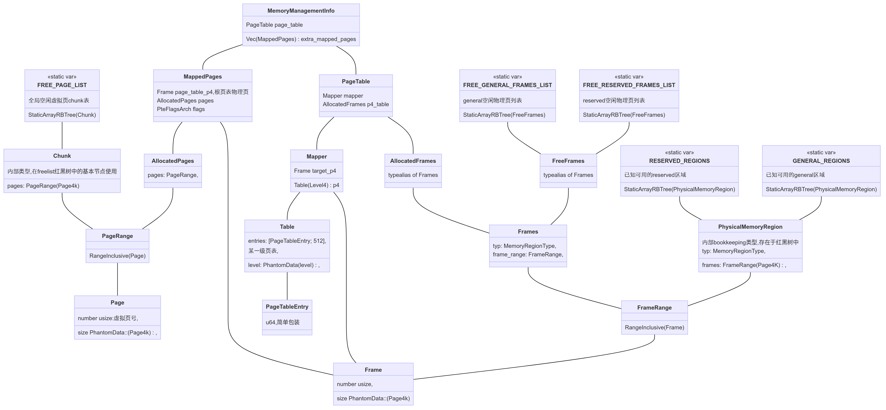

# 结构体



## memory_struct:

- 页框和虚拟页

  ```rust
  implement_page_frame!(Page, "virtual", "v", VirtualAddress);
  implement_page_frame!(Frame, "physical", "p", PhysicalAddress);
  pub struct $TypeName<P: PageSize = Page4K> {
      /// A Page or Frame number is *always* given in terms of 4KiB pages/frames,
      /// even for huge pages/frames.
      number: usize,
      size: PhantomData::<P>,
  }
  ```

  number为虚拟页号或者页框号，按照页大小顺序分配

- page/frame range

  ```rust
  implement_page_frame_range!(PageRange, "virtual", virt, Page, VirtualAddress);
  implement_page_frame_range!(FrameRange, "physical", phys, Frame, PhysicalAddress);
  
  
  pub struct PageRange<P: PageSize = Page4K>(RangeInclusive<Page::<P>>);
  pub struct FrameRange<P: PageSize = Page4K>(RangeInclusive<Frame::<P>>);
  
  /// A range bounded inclusively below and above (`start..=end`).
  #[derive(Copy, Clone, PartialEq, Eq, Hash)]
  pub struct RangeInclusive<Idx: Clone + PartialOrd> {
      pub(crate) start: Idx,
      pub(crate) end: Idx
  }
  ```

## page_allocator

- chunk,内部类型，在freelist红黑树中的基本节点使用

  ```rust
  /// A range of contiguous 4K-sized pages.
  #[derive(Debug, Clone, Eq)]
  struct Chunk {
  	/// The Pages covered by this chunk, an inclusive range. 
  	pages: PageRange<Page4K>,
  }
  ```

- AllocatedPages,申请一定数量的虚拟页面时分配函数返回的类型

  ```rust
  /// Represents a range of allocated `VirtualAddress`es, specified in `Page`s. 
  /// These pages are not initially mapped to any physical memory frames, you must do that separately
  /// in order to actually use their memory; see the `MappedPages` type for more. 
  /// This object represents ownership of the allocated virtual pages;
  /// if this object falls out of scope, its allocated pages will be auto-deallocated upon drop. 
  pub struct AllocatedPages<P: PageSize = Page4K> {
  	pages: PageRange<P>,
  }
  ```

## frame_allocator

- Frames,外部类型，较虚拟页复杂一点，可以有多种状态，每个状态由不同别名

  ```rust
  pub struct Frames<const S: MemoryState, P: PageSize = Page4K> {
      /// The type of this memory chunk, e.g., whether it's in a free or reserved region.
      typ: MemoryRegionType,
      /// The specific (inclusive) range of frames covered by this memory chunk.
      frame_range: FrameRange<P>,
  }
  
  pub type FreeFrames = Frames<{MemoryState::Free}, Page4K>;
  /// A type alias for `Frames` in the `Allocated` state.
  pub type AllocatedFrames<P: PageSize = Page4K> = Frames<{MemoryState::Allocated}, P>;
  /// A type alias for `Frames` in the `Mapped` state.
  pub type MappedFrames<P: PageSize = Page4K> = Frames<{MemoryState::Mapped}, P>;
  /// A type alias for `Frames` in the `Unmapped` state.
  pub type UnmappedFrames<P: PageSize = Page4K> = Frames<{MemoryState::Unmapped}, P>;
  ```

  - FreeFrames用于FREE_LIST的内部类型，`FREE_GENERAL_FRAMES_LIST: Mutex<StaticArrayRBTree<FreeFrames>>`

- PhysicalMemoryRegion,不表示是否分配，bookkeeping结构

  ```rust
  /// `PhysicalMemoryRegion` represents a range of contiguous frames in physical memory for bookkeeping purposes.
  /// It does not give access to the underlying frames.
  #[derive(Clone, Debug, Eq)]
  pub struct PhysicalMemoryRegion {
      /// The Frames covered by this region, an inclusive range. 
      pub frames: FrameRange<Page4K>,
      /// The type of this memory region, e.g., whether it's in a free or reserved region.
      pub typ: MemoryRegionType,
  }
  ```
  

## memory_crate

- 全局分页管理器`MemoryManagementInfo`

  ```rust
  /// The memory management info and address space of the kernel
  static KERNEL_MMI: Once<MmiRef> = Once::new();
  
  /// A shareable reference to a `MemoryManagementInfo` struct wrapper in a lock.
  pub type MmiRef = Arc<IrqSafeMutex<MemoryManagementInfo>>;
  
  pub struct MemoryManagementInfo {
      /// the PageTable that should be switched to when this Task is switched to.
      pub page_table: PageTable,
      
      /// The list of additional memory mappings that have the same lifetime as this MMI
      /// and are thus owned by this MMI.
      /// This currently includes only the mappings for the heap and the early VGA buffer.
      pub extra_mapped_pages: Vec<MappedPages>,
  }
  
  /// A top-level root (P4) page table.
  /// 
  /// Auto-derefs into a `Mapper` for easy invocation of memory mapping functions.
  pub struct PageTable {
      mapper: Mapper,
      p4_table: AllocatedFrames,
  }
  
  pub struct Mapper {
      p4: Unique<Table<Level4>>,
      /// The Frame contaning the top-level P4 page table.
      pub(crate) target_p4: Frame<Page4K>,
  }
  
  pub struct Table<L: TableLevel> {
      entries: [PageTableEntry; ENTRIES_PER_PAGE_TABLE],
      level: PhantomData<L>,
  }
  ```

  - 所有的task共享一个全局的`MemoryManagementInfo`，通过mutex和arc包装实现线程间共享和互斥访问

- MappedPages

  - 访问内存的唯一方法，声明周期和虚拟页/物理页框绑定，同时析构
  - [Mapping Virtual to Physical Memory - The Theseus OS Book (theseus-os.com)](https://www.theseus-os.com/Theseus/book/subsystems/memory_mapping.html)详细介绍MappedPages设计理念

  ```rust
  pub struct MappedPages {
      /// The Frame containing the top-level P4 page table that this MappedPages was originally mapped into. 
      page_table_p4: Frame<Page4K>,
      /// The range of allocated virtual pages contained by this mapping.
      pages: AllocatedPages,
      // The PTE flags that define the page permissions of this mapping.
      flags: PteFlagsArch,
  }
  ```


# 核心函数

## memory/mapper

### map_allocated_pages

`直接调用这个函数：`

- create_mapping
- init_memory_management
- mod_mgmt/lib/allocate_section_pages
- inner_alloc_stack
- create_heap_mapping
- loadc/lib/parse_and_load_elf_executable
- memfs/lib/write_at
- framebuffer/lib/new(impl Frambuffer)
- debuf_info/lib/allocate_debug_section_pages
- early_printer/lib/init


## allocate_pages_deferred

- 分配一段虚拟页面的核心函数
- 对FREE_PAGE_LIST上锁
- 调用find__chunk函数进行页面分配，在红黑树中搜寻符合分配条件的chunk，调用adjust_chosen_chunk
- adjust_chosen_chunk将选中的chunk挖出要分配的页面，返回分配好的页面

## 全局变量

- `FREE_PAGE_LIST` 全局虚拟页面free list

  type `Mutex<StaticArrayRBTree<Chunk>>`

  ```rust
  --------------- FREE PAGES LIST ---------------
  Chunk { pages: Page(v0x0)..=Page(v0x812000) }
  Chunk { pages: Page(v0x813000)..=Page(v0xFFFFFDFFFFFFF000) }
  Chunk { pages: Page(v0xFFFFFE8000000000)..=Page(v0xFFFFFEFFFFFFF000) }
  Chunk { pages: Page(v0xFFFFFF8000000000)..=Page(v0xFFFFFFFFFFFFF000) }
  //初始状态
  ----------------- FREE GENERAL FRAMES --------------- 
  
  	Frames(Frame(p0x1DBE000)..=Frame(p0x1FFDF000), Free) 
  
  ----------------------------------------------------- 
  
  ----------------- FREE RESERVED FRAMES -------------- 
  
  	Frames(Frame(p0x0)..=Frame(p0xFF000), Reserved) 
  
  	Frames(Frame(p0x100000)..=Frame(p0x1DBD000), Reserved) 
  
  ----------------------------------------------------- 
  
  ------------------ GENERAL REGIONS ----------------- 
  
  	PhysicalMemoryRegion { frames  Frame(p0x1DBE000)..=Frame(p0x1FFDF000), typ  Free } 
  
  ----------------------------------------------------- 
  
  ------------------ RESERVED REGIONS ----------------- 
  
  	PhysicalMemoryRegion { frames  Frame(p0x0)..=Frame(p0xFF000), typ  Reserved } 
  
  	PhysicalMemoryRegion { frames  Frame(p0x100000)..=Frame(p0x1DBD000), typ  Reserved } 
  
  ----------------------------------------------------- 
  
  
  [D]  1376: ----------------- FREE GENERAL FRAMES ---------------
  [D]  1377:      Frames(Frame(p0x1DC6000)..=Frame(p0x1EB3000), Free)
  [D]  1377:      Frames(Frame(p0x1EB5000)..=Frame(p0x20B4000), Free)
  [D]  1377:      Frames(Frame(p0x20B6000)..=Frame(p0x22B5000), Free)
  [D]  1377:      Frames(Frame(p0x22B7000)..=Frame(p0x22C8000), Free)
  [D]  1377:      Frames(Frame(p0x6306000)..=Frame(p0x6336000), Free)
  [D]  1377:      Frames(Frame(p0x6348000)..=Frame(p0x6368000), Free)
  [D]  1377:      Frames(Frame(p0x8402000)..=Frame(p0x8403000), Free)
  [D]  1377:      Frames(Frame(p0x8413000)..=Frame(p0x8418000), Free)
  [D]  1377:      Frames(Frame(p0x841D000)..=Frame(p0x8422000), Free)
  [D]  1377:      Frames(Frame(p0x842E000)..=Frame(p0x8431000), Free)
  [D]  1377:      Frames(Frame(p0x8433000)..=Frame(p0x8436000), Free)
  [D]  1377:      Frames(Frame(p0x843B000)..=Frame(p0x844A000), Free)
  [D]  1377:      Frames(Frame(p0x8468000)..=Frame(p0x8477000), Free)
  [D]  1377:      Frames(Frame(p0x89A2000)..=Frame(p0x8AA1000), Free)
  [D]  1377:      Frames(Frame(p0x8AA4000)..=Frame(p0x8EA3000), Free)
  [D]  1377:      Frames(Frame(p0x8EA6000)..=Frame(p0x1FFDF000), Free)
  [D]  1378: -----------------------------------------------------
  [D]  1379: ----------------- FREE RESERVED FRAMES --------------
  [D]  1380:      Frames(Frame(p0x0)..=Frame(p0xE000), Reserved)
  [D]  1380:      Frames(Frame(p0xF000)..=Frame(p0x9F000), Reserved)
  [D]  1380:      Frames(Frame(p0xC0000)..=Frame(p0xFF000), Reserved)
  [D]  1380:      Frames(Frame(p0x532000)..=Frame(p0x532000), Reserved)
  [D]  1380:      Frames(Frame(p0x533000)..=Frame(p0x632000), Reserved)
  [D]  1380:      Frames(Frame(p0x800000)..=Frame(p0x811000), Reserved)
  [D]  1380:      Frames(Frame(p0x1DAF000)..=Frame(p0x1DB3000), Reserved)
  [D]  1381: -----------------------------------------------------
  [D]  1382: ------------------ GENERAL REGIONS -----------------
  [D]  1383:      PhysicalMemoryRegion { frames: Frame(p0x1DB4000)..=Frame(p0x1FFDF000), typ: Free }
  [D]  1384: -----------------------------------------------------
  [D]  1385: ------------------ RESERVED REGIONS -----------------
  [D]  1386:      PhysicalMemoryRegion { frames: Frame(p0x0)..=Frame(p0xFF000), typ: Reserved }
  [D]  1386:      PhysicalMemoryRegion { frames: Frame(p0x100000)..=Frame(p0x1DB3000), typ: Reserved }
  [D]  1386:      PhysicalMemoryRegion { frames: Frame(p0x1FFE1000)..=Frame(p0x1FFE1000), typ: Reserved }
  [D]  1386:      PhysicalMemoryRegion { frames: Frame(p0xFD000000)..=Frame(p0xFD4FF000), typ: Reserved }
  [D]  1386:      PhysicalMemoryRegion { frames: Frame(p0xFEC00000)..=Frame(p0xFEC00000), typ: Reserved }
  [D]  1386:      PhysicalMemoryRegion { frames: Frame(p0xFED00000)..=Frame(p0xFED00000), typ: Reserved }
  [D]  1386:      PhysicalMemoryRegion { frames: Frame(p0xFEE00000)..=Frame(p0xFEE00000), typ: Reserved }
  [D]  1387: -----------------------------------------------------
  ```
  
  

## init

- page allocator的初始化函数

## Allocated Pages

- 一片连续的页，拥有单一的拥有者