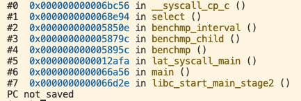

```shell
echo latency measurements
lmbench_musl lat_syscall -P 1 null ✅
lmbench_musl lat_syscall -P 1 read✅
lmbench_musl lat_syscall -P 1 write✅
busybox mkdir -p /var/tmp 
busybox touch /var/tmp/lmbench
lmbench_musl lat_syscall -P 1 stat hello ✅
lmbench_musl lat_syscall -P 1 fstat hello ✅
lmbench_musl lat_syscall -P 1 open test ✅
lmbench_musl lat_select -n 100 -P 1 file //not found in lmbench_musl
lmbench_musl lat_sig -P 1 install ✅
lmbench_musl lat_sig -P 1 catch  //fail
lmbench_musl lat_sig -P 1 prot lat_sig  //fail
lmbench_musl lat_pipe -P 1 ✅
lmbench_musl lat_proc -P 1 fork ✅
lmbench_musl lat_proc -P 1 exec ✅
busybox cp hello /tmp
lmbench_musl lat_proc -P 1 shell ✅
lmbench_musl lmdd label="File /var/tmp/XXX write bandwidth:" of=/dev/zero move=512m fsync=1 print=3
lmbench_musl lmdd of=/dev/zero move=10m fsync=1 print=3 ✅
lmbench_musl lat_pagefault -P 1 test ✅
lmbench_musl lat_mmap -P 1 512k test ✅
busybox echo file system latency
lmbench_musl lat_fs /var/tmp  ✅ 
busybox echo Bandwidth measurements
lmbench_musl bw_pipe -P 1 -m 1024 -M 1024 ✅
lmbench_musl bw_file_rd -P 1 512k io_only test ✅
lmbench_musl bw_file_rd -P 1 512k open2close test ✅
lmbench_musl bw_mmap_rd -P 1 512k mmap_only test ✅
lmbench_musl bw_mmap_rd -P 1 512k open2close test ✅
busybox echo context switch overhead
lmbench_musl lat_ctx -P 1 -s 32 2 4 8 16 24 32 64 96 //partial success
```


|                    test                    |                            result                            |
| :----------------------------------------: | :----------------------------------------------------------: |
|           lat_syscall -P 1 null            |            Simple syscall: `3.7935` microseconds             |
|           lat_syscall -P 1 read            |             Simple read:` 64.3000` microseconds              |
|           lat_syscall -P 1 write           |            Simple write: `212.0769` microseconds             |
|        lat_syscall -P 1 stat hello         |             Simple stat: `188.5862` microseconds             |
|        lat_syscall -P 1 fstat hello        |             Simple fstat: `9.4718` microseconds              |
|        lat_syscall -P 1 open hello         |          Simple open/close: `194.0000` microseconds          |
|            lat_sig -P 1 install            |      Signal handler installation: `7.7637` microseconds      |
|               lat_pipe -P 1                |             Pipe latency: `99.8388` microseconds             |
|             lat_proc -P 1 fork             |          Process fork+exit: `397.5833` microseconds          |
|             lat_proc -P 1 exec             |         Process fork+execve: `416.5000` microseconds         |
|            lat_proc -P 1 shell             |       Process fork+/bin/sh -c: `396.3571` microseconds       |
| lmdd of=/dev/zero move=10m fsync=1 print=3 |                        `29914` KB/sec                        |
|          lat_pagefault -P 1 test           |         Pagefaults on test: `119.2568` microseconds          |
|          lat_mmap -P 1 512k test           |                       `0.524288` `686`                       |
|            lmbench_musl lat_fs             | 0k      11      986     2828<br/>1k      9       752     2701<br/>  4k      8       730     2534<br/>10k     8       697     2396<br/> |
|        bw_pipe -P 1 -m 1024 -M 1024        |                Pipe bandwidth: `17.74` MB/sec                |
|    bw_mmap_rd -P 1 512k mmap_only test     |                    `0.524288` `15551.29`                     |
|    bw_mmap_rd -P 1 512k open2close test    |                     `0.524288` `301.57`                      |
|     bw_file_rd -P 1 512k io_only test      |                     `0.524288` `343.63`                      |
|                                            |                                                              |


# strace on riscv-linux

pipe2([3, 4], 0)                        = 0
pipe2([5, 6], 0)                        = 0
pipe2([7, 8], 0)                        = 0
pipe2([9, 10], 0)                       = 0
rt_sigprocmask(SIG_UNBLOCK, [RT_1 RT_2], NULL, 8) = 0
rt_sigaction(SIGTERM, {sa_handler=0x56942, sa_mask=[ABRT BUS FPE USR2 ALRM TERM STKFLT CONT STOP], sa_flags=SA_RESTART|0x4000000}, {sa_handler=SIG_DFL, sa_mask=[], sa_flags=0}, 8) = 0
rt_sigaction(SIGCHLD, {sa_handler=0x56968, sa_mask=[ABRT BUS FPE USR2 ALRM TERM STKFLT CONT STOP], sa_flags=SA_RESTART|0x4000000}, {sa_handler=SIG_DFL, sa_mask=[], sa_flags=0}, 8) = 0
brk(NULL)                               = 0x7c000
brk(0x7e000)                            = 0x7e000
mmap(0x7c000, 4096, PROT_NONE, MAP_PRIVATE|MAP_FIXED|MAP_ANONYMOUS, -1, 0) = 0x7c000
mmap(NULL, 4096, PROT_READ|PROT_WRITE, MAP_PRIVATE|MAP_ANONYMOUS, -1, 0) = 0x7fff9f8ae000
rt_sigprocmask(SIG_BLOCK, ~[RTMIN RT_1 RT_2], [], 8) = 0
rt_sigprocmask(SIG_BLOCK, ~[], ~[KILL STOP RTMIN RT_1 RT_2], 8) = 0
clone(child_stack=NULL, flags=SIGCHLD)  = 98
rt_sigprocmask(SIG_SETMASK, ~[KILL STOP RTMIN RT_1 RT_2], NULL, 8) = 0
rt_sigprocmask(SIG_SETMASK, [], NULL, 8) = 0
close(4)                                = 0
close(5)                                = 0
close(7)                                = 0
close(9)                                = 0
pselect6(4, [3], NULL, [3], {tv_sec=1, tv_nsec=0}, {sigmask=NULL, sigsetsize=8}) = 1 (in [3], left {tv_sec=0, tv_nsec=999876800})
read(3, "\0", 1)                        = 1
write(6, "\0", 1)                       = 1
pselect6(4, [3], NULL, [3], {tv_sec=1, tv_nsec=0}, {sigmask=NULL, sigsetsize=8}) = 0 (Timeout)
pselect6(4, [3], NULL, [3], {tv_sec=1, tv_nsec=0}, {sigmask=NULL, sigsetsize=8}) = 0 (Timeout)
pselect6(4, [3], NULL, [3], {tv_sec=1, tv_nsec=0}, {sigmask=NULL, sigsetsize=8}) = 0 (Timeout)
pselect6(4, [3], NULL, [3], {tv_sec=1, tv_nsec=0}, {sigmask=NULL, sigsetsize=8}) = 0 (Timeout)
pselect6(4, [3], NULL, [3], {tv_sec=1, tv_nsec=0}, {sigmask=NULL, sigsetsize=8}) = 0 (Timeout)
pselect6(4, [3], NULL, [3], {tv_sec=1, tv_nsec=0}, {sigmask=NULL, sigsetsize=8}) = 0 (Timeout)
pselect6(4, [3], NULL, [3], {tv_sec=1, tv_nsec=0}, {sigmask=NULL, sigsetsize=8}) = 0 (Timeout)
pselect6(4, [3], NULL, [3], {tv_sec=1, tv_nsec=0}, {sigmask=NULL, sigsetsize=8}) = 0 (Timeout)
pselect6(4, [3], NULL, [3], {tv_sec=1, tv_nsec=0}, {sigmask=NULL, sigsetsize=8}) = 0 (Timeout)
pselect6(4, [3], NULL, [3], {tv_sec=1, tv_nsec=0}, {sigmask=NULL, sigsetsize=8}) = 0 (Timeout)
pselect6(4, [3], NULL, [3], {tv_sec=1, tv_nsec=0}, {sigmask=NULL, sigsetsize=8}) = 0 (Timeout)
pselect6(4, [3], NULL, [3], {tv_sec=1, tv_nsec=0}, {sigmask=NULL, sigsetsize=8}) = 0 (Timeout)
pselect6(4, [3], NULL, [3], {tv_sec=1, tv_nsec=0}, {sigmask=NULL, sigsetsize=8}) = 1 (in [3], left {tv_sec=0, tv_nsec=92568400})
read(3, "\0", 1)                        = 1
write(8, "\0", 1)                       = 1
pselect6(4, [3], NULL, [3], {tv_sec=1, tv_nsec=0}, {sigmask=NULL, sigsetsize=8}) = 1 (in [3], left {tv_sec=0, tv_nsec=999869500})
read(3, "\v\0\0\0\0\0\0\0\374\356\20\0\0\0\0\0\340\345\36\0\0\0\0\08\342\20\0\0\0\0\0"..., 184) = 184
rt_sigaction(SIGCHLD, {sa_handler=SIG_DFL, sa_mask=[ABRT BUS FPE USR2 ALRM TERM STKFLT CONT STOP], sa_flags=SA_RESTART|0x4000000}, {sa_handler=0x56968, sa_mask=[ABRT BUS FPE USR2 ALRM TERM STKFLT CONT], sa_flags=SA_RESTART}, 8) = 0
write(10, "\v", 1)                      = 1
--- SIGCHLD {si_signo=SIGCHLD, si_code=CLD_EXITED, si_pid=98, si_uid=0, si_status=0, si_utime=2 /* 0.02 s */, si_stime=1289 /* 12.89 s */} ---
close(3)                                = 0
close(6)                                = 0
close(8)                                = 0
close(10)                               = 0
rt_sigaction(SIGCHLD, {sa_handler=SIG_DFL, sa_mask=[ABRT BUS FPE USR2 ALRM TERM STKFLT CONT STOP], sa_flags=SA_RESTART|0x4000000}, {sa_handler=SIG_DFL, sa_mask=[ABRT BUS FPE USR2 ALRM TERM STKFLT CONT], sa_flags=SA_RESTART}, 8) = 0
rt_sigaction(SIGALRM, {sa_handler=0x569e6, sa_mask=[ABRT BUS FPE USR2 ALRM TERM STKFLT CONT STOP], sa_flags=SA_RESTART|0x4000000}, {sa_handler=SIG_DFL, sa_mask=[], sa_flags=0}, 8) = 0
setitimer(ITIMER_REAL, {it_interval={tv_sec=0, tv_usec=0}, it_value={tv_sec=5, tv_usec=0}}, {it_interval={tv_sec=0, tv_usec=0}, it_value={tv_sec=0, tv_usec=0}}) = 0
wait4(98, NULL, 0, NULL)                = 98
setitimer(ITIMER_REAL, {it_interval={tv_sec=0, tv_usec=0}, it_value={tv_sec=0, tv_usec=0}}, {it_interval={tv_sec=0, tv_usec=0}, it_value={tv_sec=4, tv_usec=998513}}) = 0
rt_sigaction(SIGALRM, {sa_handler=SIG_DFL, sa_mask=[ABRT BUS FPE USR2 ALRM TERM STKFLT CONT STOP], sa_flags=SA_RESTART|0x4000000}, {sa_handler=0x569e6, sa_mask=[ABRT BUS FPE USR2 ALRM TERM STKFLT CONT], sa_flags=SA_RESTART}, 8) = 0
writev(2, [{iov_base="Simple syscall: 0.5427 microseco"..., iov_len=36}, {iov_base=NULL, iov_len=0}], 2Simple syscall: 0.5427 microseconds
) = 36
exit_group(0)                           = ?
+++ exited with 0 +++




子线程第一次getppid后的第一个pselect返回后的 backtrace


b bw_file_rd.c:180


