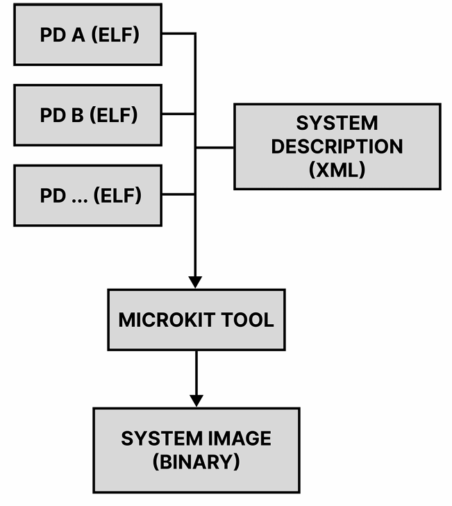

# microkit架构



- Init task是monitor.elf
- 每个pd的elf对应一个c的文件，组织结构在xml文件中
- microkit tool用py脚本解析XML文件

# main.py 初始化

- 为elf文件分配内存
- emulate_boot_kernel，提供boot_info
- monitor bootstrap
  - 初始化Cspace
  - 填写system invocation table
- 使用invocations列表生成syscall

## Monitor bootstrap

monitor的cspace有两个cnode

1. initial task Cnode(root Cnode)
2. system Cnode，*root of the CSpace*；initialtaskcnode会被拷贝到systemcnode的0号slot

### 创建`bootstrap_invocations`系统调用列表

1. root_cnode `Sel4UntypedRetype`，在sel4的根cspace93号slot中创建
2. 把索引根cspace的Cnode mint到rootcnode0号slot中
3. 设置根root_cnode的TCB和VSPACE
4. system_cnode `Sel4UntypedRetype`，在sel4的根cspace94号slot中创建
5. 把system_cnode mint到root_cnode 1号slot中
6. 将存储invocations的页框map到vspace中，retype了一个pagetable_cap和一个page_cap

## System bootstrap

- 为每个pd创建caps

  > TCBs: one per PD
  >
  > Endpoints: one per PD with a PP + one for the monitor
  >
  > Notification: one per PD
  >
  > VSpaces: one per PD
  >
  > CNodes: one per PD
  >
  > Small Pages:
  >
  > ​	one per pd for IPC buffer
  >
  > ​	as needed by MRs
  >
  > Large Pages: as needed by MRs
  >
  > Page table structs: as needed by protection domains based on mappings required

  1. page_object,包含memory regions
  2. TCB，SCHEDCONTEXT,REPLY,ENDPOINT,NTFN
  3. vspace,page_tables
  4. Cnodes
  5. IRQS

- 通过mint创建每个cap的副本

- bind ntfn to irqs

- map all pages

- Initialise the TCBs

# `NTFN/channel/irq初始化`

1. 为每个保护域初始化一个通信单元内核对象（notification）

```python
notification_names = [f"Notification: PD={pd.name}" for pd in system.protection_domains]
notification_objects = init_system.allocate_objects(SEL4_NOTIFICATION_OBJECT, notification_names)
notification_objects_by_pd = dict(zip(system.protection_domains, notification_objects))
notification_caps = [ntfn.cap_addr for ntfn in notification_objects]
```

2. 轮询保护域列表，为各个保护域内的每个中断号创建中断对象（IRQ Handler）

```python
irq_cap_addresses: Dict[ProtectionDomain, List[int]] = {pd: [] for pd in system.protection_domains}
    for pd in system.protection_domains:
        for sysirq in pd.irqs:
            cap_address = system_cap_address_mask | cap_slot
            system_invocations.append(
                Sel4IrqControlGetTrigger(
                    IRQ_CONTROL_CAP_ADDRESS,
                    sysirq.irq,
                    sysirq.trigger.value,
                    root_cnode_cap,
                    cap_address,
                    kernel_config.cap_address_bits
                )
            )

            cap_slot += 1
            cap_address_names[cap_address] = f"IRQ Handler: irq={sysirq.irq:d}"
            irq_cap_addresses[pd].append(cap_address)
```

`system_invocations`存储全部的系统调用，初始化结束后以bytes形式共享至microkit/src/main.c文件，调用perform_invocation函数进行实质系统调用。

3. 轮询保护域列表，复制保护域中断数份的通信单元 capability，并基于中断号对应的 ID 为复制 Cap 添加 Badge，指示保护域内中断通信的 capability 相对地址

```python
badged_irq_caps: Dict[ProtectionDomain, List[int]] = {pd: [] for pd in system.protection_domains}
    for notification_obj, pd in zip(notification_objects, system.protection_domains):
        for sysirq in pd.irqs:
            badge = 1 << sysirq.id_
            badged_cap_address = system_cap_address_mask | cap_slot
            system_invocations.append(
                Sel4CnodeMint(
                    system_cnode_cap,
                    cap_slot,
                    system_cnode_bits,
                    root_cnode_cap,
                    notification_obj.cap_addr,
                    kernel_config.cap_address_bits,
                    SEL4_RIGHTS_ALL,
                    badge)
            )
            cap_address_names[badged_cap_address] = cap_address_names[notification_obj.cap_addr] + f" (badge=0x{badge:x})"
            badged_irq_caps[pd].append(badged_cap_address)
            cap_slot += 1
```

4. 轮询保护域列表，绑定中断对象和上述带 Badge 的通信单元 capability

```python
invocation = Sel4TcbBindNotification(tcb_objects[0].cap_addr, notification_objects[0].cap_addr)
invocation.repeat(count=len(system.protection_domains), tcb=1, notification=1)
system_invocations.append(invocation)
```

5. channel初始化

```python
for cc in system.channels:
        pd_a = system.pd_by_name[cc.pd_a]
        pd_b = system.pd_by_name[cc.pd_b]
        pd_a_cnode_obj = cnode_objects_by_pd[pd_a]
        pd_b_cnode_obj = cnode_objects_by_pd[pd_b]
        pd_a_notification_obj = notification_objects_by_pd[pd_a]
        pd_b_notification_obj = notification_objects_by_pd[pd_b]
        pd_a_endpoint_obj = pp_ep_endpoint_objects.get(pd_a)
        pd_b_endpoint_obj = pp_ep_endpoint_objects.get(pd_b)

        # Set up the notification baps
        pd_a_cap_idx = BASE_OUTPUT_NOTIFICATION_CAP + cc.id_a
        pd_a_badge = 1 << cc.id_b
        #pd_a.cnode.mint(pd_a_cap_idx, PD_CAPTABLE_BITS, sel4.init_cnode, pd_b.notification, 64, SEL4_RIGHTS_ALL, pd_a_badge)
        assert pd_a_cap_idx < PD_CAP_SIZE
        system_invocations.append(
            Sel4CnodeMint(
                pd_a_cnode_obj.cap_addr,
                pd_a_cap_idx,
                PD_CAP_BITS,
                root_cnode_cap,
                pd_b_notification_obj.cap_addr,
                kernel_config.cap_address_bits,
                SEL4_RIGHTS_ALL,  # FIXME: Check rights
                pd_a_badge)
        )

        pd_b_cap_idx = BASE_OUTPUT_NOTIFICATION_CAP + cc.id_b
        pd_b_badge = 1 << cc.id_a
        #pd_b.cnode.mint(pd_b_cap_idx, PD_CAPTABLE_BITS, sel4.init_cnode, pd_a.notification, 64, SEL4_RIGHTS_ALL, pd_b_badge)
        assert pd_b_cap_idx < PD_CAP_SIZE
        system_invocations.append(
            Sel4CnodeMint(
                pd_b_cnode_obj.cap_addr,
                pd_b_cap_idx,
                PD_CAP_BITS,
                root_cnode_cap,
                pd_a_notification_obj.cap_addr,
                kernel_config.cap_address_bits,
                SEL4_RIGHTS_ALL,  # FIXME: Check rights
                pd_b_badge)
        )
```

# 


