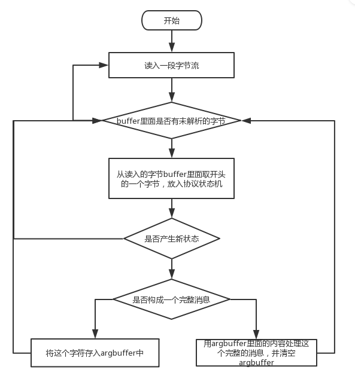
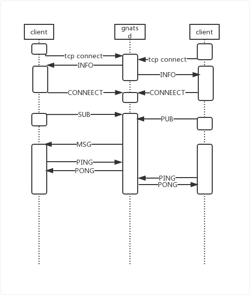
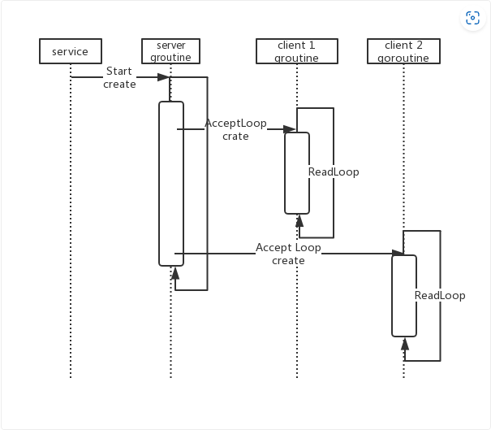

# 消息格式解析

1. 尽可能的避免内存分配 
2. 尽可能的避免内存复制(zero copy) 

#### 主题的树状组织

按照前面的描述当客户端在一个主题下pub消息的时候,服务器要能找到所有对这个主题感兴趣的客户端,因为要支持*和>的模糊匹配,使用trie树来组织比较合理.

明显这里的trie树是系统的核心数据,每一次client的pub都要来这里查找所有相关的sub,如果这里设计的不好肯定会造成系统的瓶颈. 1. 这颗trie树是全局的,每一次新的订阅和连接的断开都需要更新 2. 每一次pub都需要在树中查找. 所以树的访问必须带锁;为了避免重复查找


## 消息格式解析的思路

出于性能考虑,应该考虑如下问题: 1. 尽可能的避免内存分配 2. 尽可能的避免内存复制(zero copy) 3. 不要使用正则表达式去匹配

# simple_sublist.rs

在 `SimpleSubList` 中，`subs` 和 `qsubs` 分别用于存储普通订阅（非队列订阅）和队列订阅。这两个数据结构是 `SimpleSubList` 的两个字段。

1. **`subs` 字段：**
   - 类型：`HashMap<String, BTreeSet<ArcSubscriptionWrapper>>`
   - 作用：存储普通主题的订阅列表。
   - 结构：以主题（`String`）为键，对应的订阅集合（`BTreeSet<ArcSubscriptionWrapper>`）为值。
   - 每个主题对应一个 BTreeSet，其中包含了多个 `ArcSubscriptionWrapper`，即普通订阅的集合。

2. **`qsubs` 字段：**
   - 类型：`HashMap<String, HashMap<String, BTreeSet<ArcSubscriptionWrapper>>>`
   - 作用：存储队列订阅的列表。
   - 结构：以主题（`String`）为键，对应的队列订阅集合（`HashMap<String, BTreeSet<ArcSubscriptionWrapper>>`）为值。
   - 每个主题对应一个 HashMap，其中以队列名为键，对应的 BTreeSet 存储了多个 `ArcSubscriptionWrapper`，即队列订阅的集合。

在 `insert` 和 `remove` 方法中，根据订阅的类型（普通订阅或队列订阅），将订阅添加到或移除出相应的集合。在 `match_subject` 方法中，根据给定的主题，从 `subs` 和 `qsubs` 中获取相应的订阅结果，形成 `SubResult` 结构返回。

总体来说，`subs` 和 `qsubs` 是用于存储不同类型订阅的数据结构，以便在订阅管理中能够有效地区分普通订阅和队列订阅。

# Server.client.rs

- ClientMessageSender拥有writer，封装tcpstream，通过send_all函数发送msg_buf中存的消息
- process_connection函数最先被调用
- 、

subscription->msg_sender->CLientMessagesender

processsub

- 创建一个subscription
- 加入全局和局部sublist

# 协议解析





NATS client如何与server交互



# 订阅处理

# NATS client 

## CLASS

### Connection

- 定义

```rust
pub struct Connection<S: ConnectionState> {
    options: Options,
    state: S,
}

pub struct Options {
    auth: AuthStyle,
    name: Option<String>,
    no_echo: bool,
}
```

- 实现

```rust
pub fn with_name(mut self, name: &str) #为options.name赋值name
pub fn no_echo(mut self) #设置options.no_echo=true

#not_connected
pub fn new() -> Connection<NotConnected> #新建connection，状态未连接，其他为空
pub fn with_token(self, token: &str) -> Connection<Authenticated> #新建一个Connection，状态转为authenticated
pub fn with_user_pass(self, user: &str, password: &str) -> Connection<Authenticated>#另一种auth方式
```


# NATS事件驱动架构工作流程

## NATS server

- server.New()，实例化一个server类

  - server

    ```go
    type Server struct {
    	info     info
    	infoJson []byte
    	sl       *sublist.Sublist//空的trie，后续要用到
    	gcid     uint64
    }
    ```

- AcceptLoop(),调用类方法

  - 循环监听`TCP连接请求`，来一个消息创建一个client处理消息:s.createClient

- createClient（）

  - 创建client实例

    ```go
    type client struct {
    	mu   sync.Mutex
    	cid  uint64//server的第n个client
    	opts clientOpts
    	conn net.Conn
    	bw   *bufio.Writer
    	br   *bufio.Reader
        srv  *Server://调用的server的地址
    	subs *hashmap.HashMap//空
    	cstats
    	parseState
    }
    ```

  - go c.readLoop()，创建goroutine，实现并发

- readLoop()

  - 循环监听`TCP连接上的消息`，调用parse函数解析消息

- 后面进入消息解析与处理部分

  - SUB：创建subscription实例并插入client本地subs与srv.sl

    ```go
    type subscription struct {
    	client  *client//server创建的client
    	subject []byte//sublist名
    	queue   []byte//是否有队列
    	sid     []byte
    	nm      int64
    	max     int64
    }
    ```

  - PUB:在srv.sl查找所有符合传入sublist的`subscription`实例，依次发送消息。`subscription`存有订阅方与server连接实例`client`的指针，通过访问该`client`的`client.bw.Write`方法传递消息

- REQUEST/REPLY部分的特殊操作

  - processMSG时，在消息头加入reply属性

    ```go
    if c.pa.reply != nil {
    		mh = append(mh, c.pa.reply...)
    		mh = append(mh, ' ')
    	}
    ```

  - 若有queue_group，则随机选择(两个sub在同一个qsubs的前提是订阅同一个sublist)

    ```go
    	if len(qsubs) > 0 {
    		index := rand.Int() % len(qsubs)
    		sub := qsubs[index]
    		mh := c.msgHeader(msgh[:si], sub)
    		sub.deliverMsg(mh, msg)
    	}
    ```

    


# NATS Client

- 与指定的服务器建立连接

- 根据用户输入的命令执行相应操作

  - PUB：调用`write_pub_msg`向server缓冲区写入要发布的消息，

    - 一般情况：`"PUB {} {}\r\n", subj, msgb.len()`,消息与长度
    - request情况：`"PUB {} {} {}\r\n", subj, reply, msgb.len()`,消息，reply与长度

  - SUB：SUB操作不支持sub_queue,仅向server缓冲区写入消息

    - 返回client端的subscription对象

      ```rust
      pub struct Subscription {
          sid: usize,//订阅时生成
          recv: Receiver<Message>,//用于接收PUB消息
          subs: Arc<RwLock<HashMap<usize, Sender<Message>>>>,//订阅列表
          writer: Arc<Mutex<Outbound>>,//用于回复消息
      }
      ```

    - 监听recv，有消息传入执行相应操作

  - REQUEST：带有reply属性的PUB操作

    - reply属性是自动创建的sublist,`"_INBOX.{}.{}"`
    - 订阅该sublist，`self.subscribe(&reply)`
    - 和PUB一样，调用`write_pub_msg`

  - REPLY：带有queue属性的SUB操作，若多个client属于一个queuegroup且订阅同一个sublist，那么在该消息时会随机选择一个client传递消息

    - 存储用户预先设置的回复文本:`resp`
    - 同SUB操作一致，在向server发送的消息中多一个queue属性
    - 监听recv，等待消息传入，
    - 调用`respond`函数向request的client发送`resp`,发送的sublist为request_client生成的reply，


