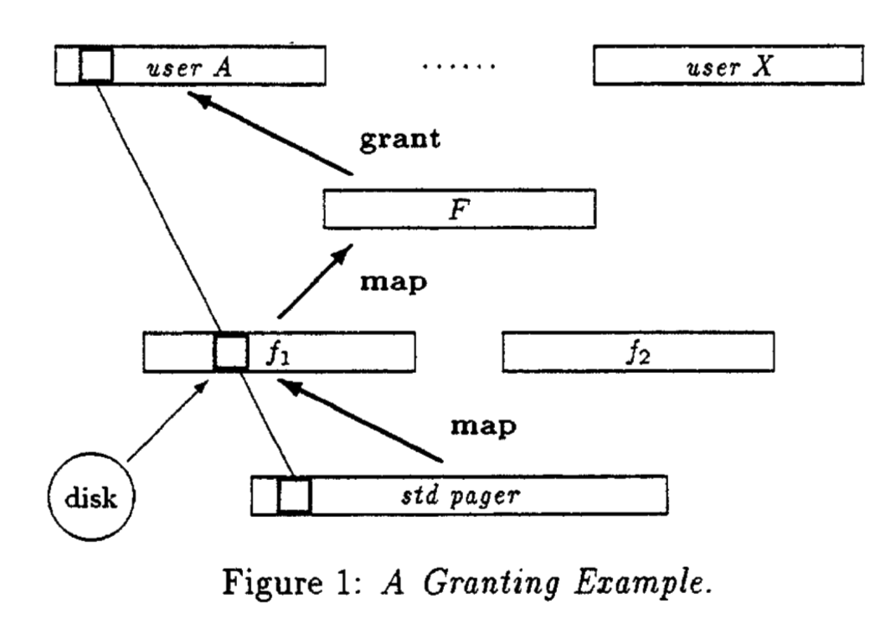

# 分页器

这段文字和图表描述了一个在微内核操作系统中进行页面授权（granting）和映射（mapping）的具体例子。这是一个关于如何在不同用户和子系统之间高效地管理内存页面的示例。

### 图表解释

图表展示了一个复合文件系统（由 F 扮演的角色），它整合了两个底层的文件系统（由 f1 和 f2 实现，这里称为 pagers），这些文件系统都建立在一个标准的分页器（standard pager）之上。F 文件系统将这两个底层文件系统的功能合二为一，形成一个统一的文件系统。

- **用户 A 和用户 X**：代表两个不同的使用者或者系统中的两个不同进程。
- **F**：是一个高级分页器，它将 f1 和 f2 的页面整合。
- **f1 和 f2**：分别代表两个独立的底层文件系统，操作在标准分页器之上。
- **磁盘**：底层存储设备，f1 和标准分页器可能直接与之交互。
- **映射（Map）与授权（Grant）**：F 从 f1 接收一个页面，并将其授予给用户 A。通过授权，这个页面从 F 中消失，只在 f1 和用户 A 中可见。

### 文字内容解释

- **授权的特殊情况**：文中描述了一个特殊情况，即 F 文件系统在整合 f1 和 f2 时，不仅仅进行页面映射，还进行了页面授权。授权使得页面从 F 的地址空间中消失，仅在 f1 和用户 A 中保持映射关系。这样做的好处是避免了在 F 中产生地址空间溢出的风险，同时减轻了 F 在页面管理上的负担。

- **页面刷新（Flushing）**：刷新操作由标准分页器执行，影响 f1 和用户 A；而由 f1 执行时，则仅影响用户 A。F 文件系统不受刷新操作的影响，因为它仅临时使用了这些页面。

- **访问权管理**：系统还可以扩展到页面的访问权限管理上。映射和授权可以复制源页面的访问权限或其子集，即可以限制访问权限，但不能扩展权限。特殊的刷新操作可能仅移除指定的访问权限。

### 总结

这个例子展示了在微内核系统中如何通过授权和映射机制高效管理内存页面，同时确保系统的灵活性和安全性。通过将页面授权给需要的用户或子系统，而非简单的映射，可以有效地减少内核或控制子系统的负担，并防止潜在的地址空间问题。

## 一个pager的例子

### 微内核中的分页器例子

假设我们有一个运行在微内核上的简化操作系统，其中包括一个标准分页器和两个专门的分页器：文件系统分页器（f1）和设备分页器（f2）。这个系统设计用来处理多种类型的存储和设备，同时确保高效和安全的内存管理。

#### **标准分页器 (Standard Pager)**
- **功能**：负责处理基本的虚拟内存管理和响应常规的页面错误。当系统中的程序尝试访问尚未加载到物理内存中的虚拟地址时，标准分页器会介入，确定如何加载所需的数据。
- **例子**：如果一个程序访问的内存页面不属于任何特定的文件系统或设备，标准分页器会从交换空间（swap space）加载该页面。

#### **文件系统分页器 (f1)**
- **功能**：管理特定文件系统的页面请求。这包括从磁盘文件中加载页面到内存，以及在页面被修改后将其写回磁盘。
- **例子**：假设一个文本编辑器正在编辑存储在磁盘上的文件。当用户滚动到文档尚未加载的部分时，文件系统分页器负责从文件中读取数据，并将其映射到程序的地址空间中。

#### **设备分页器 (f2)**
- **功能**：处理特定硬件设备相关的内存映射，例如映射视频内存或特殊硬件缓冲区。
- **例子**：在一个视频播放应用中，设备分页器可以直接映射显卡的视频内存到应用的地址空间，允许快速的视频数据渲染和访问。

### **协同工作**
在这个系统中，当一个应用程序或服务需要访问内存时，微内核首先会检查请求是否可以由特定的分页器处理。如果访问请求与文件系统相关，那么文件系统分页器（f1）会介入；如果是设备相关的，设备分页器（f2）会处理；如果是通用的内存访问，则由标准分页器处理。

这种分层和专责的设计使得每个分页器可以针对其管理的资源进行优化处理，同时通过微内核提供的隔离和通信机制确保整个系统的稳定性和安全性。每个分页器都可以独立更新和维护，而不会影响到系统的其他部分，从而提高了操作系统的可维护性和可扩展性。