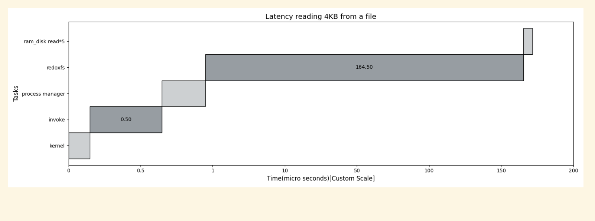
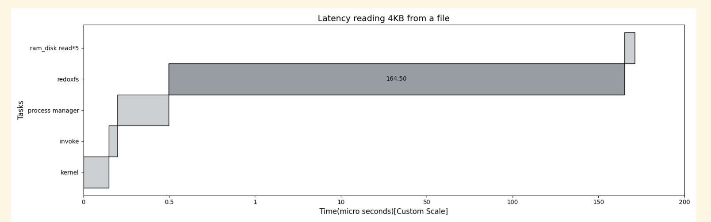
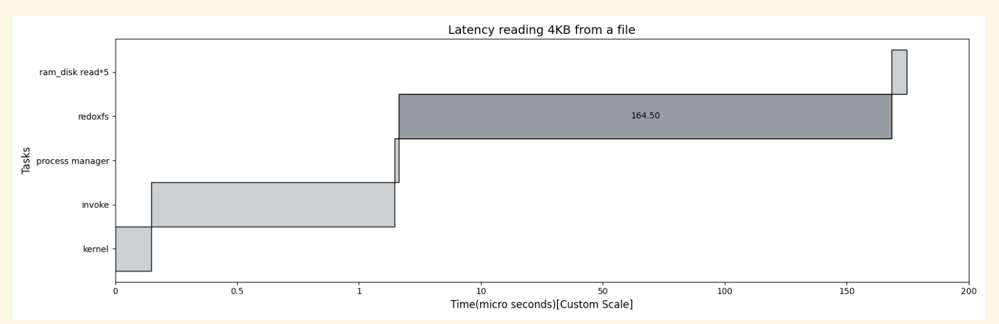
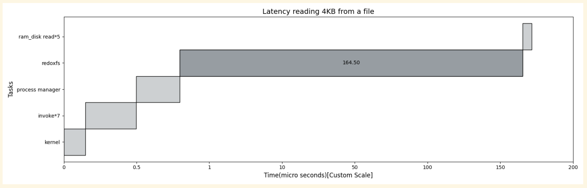
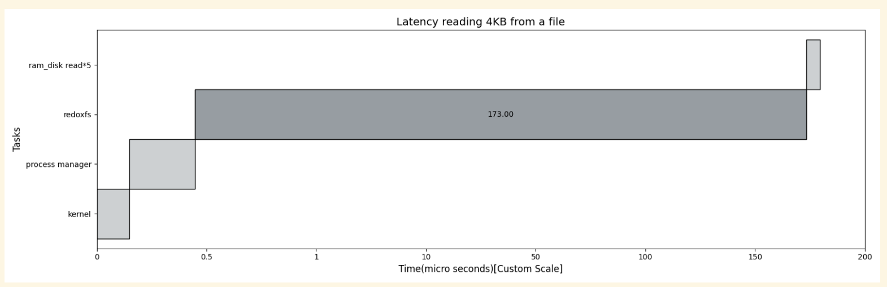
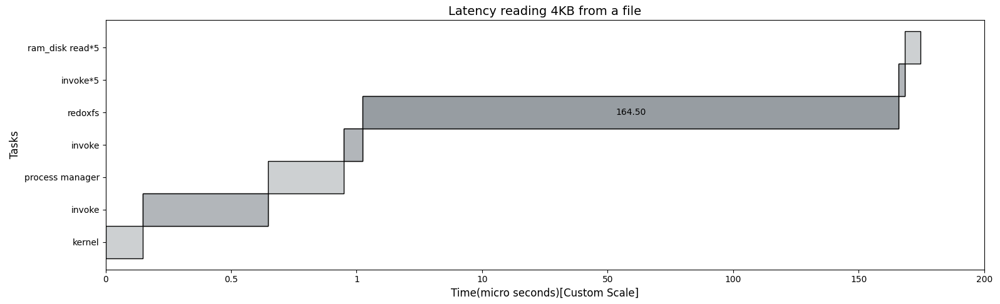
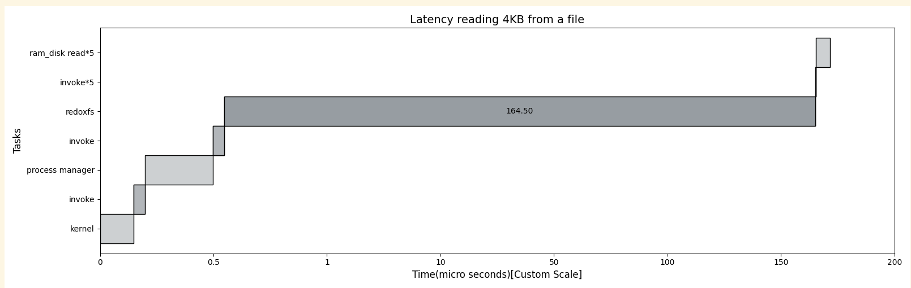

# read 4K profile using ram disk

- 方块的左右顺序代表调用链

- 1 INVOKE，实际一次read发生七次invoke

- 1 invoke，开销是优化后的0.05

- 7 invoke ,真实情况

- 7 invoke， 优化后的预期

- 去掉invoke

- 把每次invoke分开画，真实情况

- 分开画，理想情况

# 

# null

- whole rust code 617-669
- whole kernel code 96-148
- whole pm code 