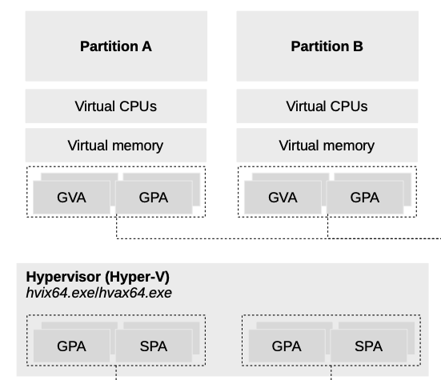
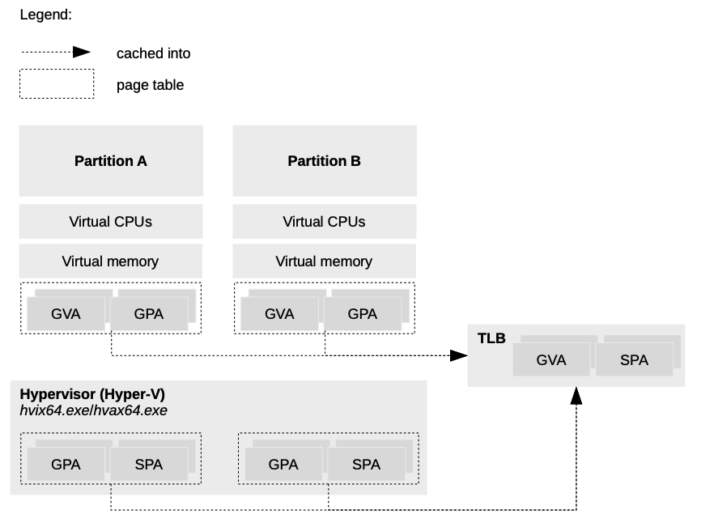
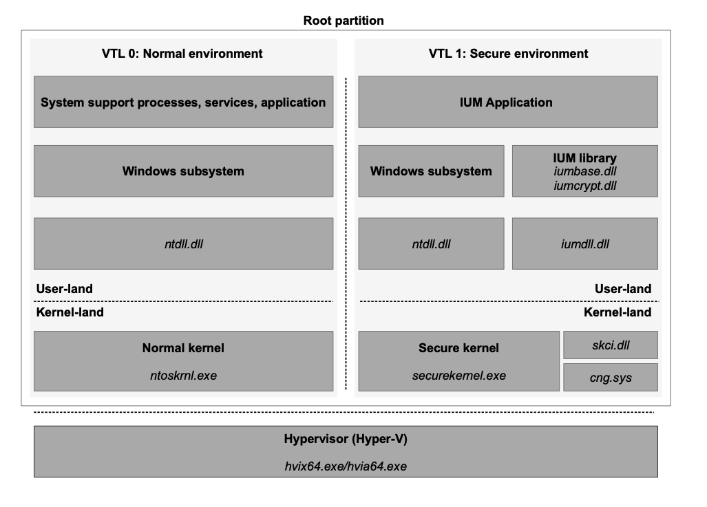
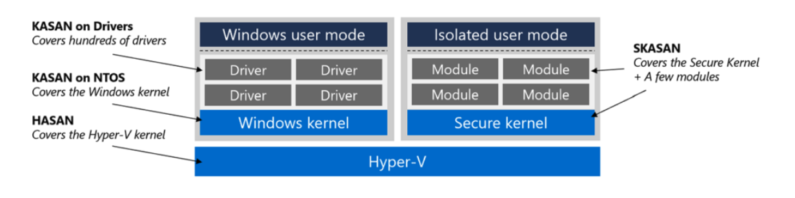

# Windows virtual secure mode

# VSM Design



## Partition

- partition是由hypervisor支持的逻辑隔离单元，执行一个或多个os。
- Root Partition是一个特权partition。它管理机器级别的功能，例如设备驱动程序、电源管理以及设备的添加/移除。root partition负责创建托管GuestOS的子partition。
- Child Partition托管一个GuestOS。child parition对物理内存和设备的所有访问都是通过VMBus或hypervisor提供的。

### inter-parition communication

- 通过 **消息** 和 **事件** 两种机制实现，均通过中断进行通知。

**1.消息机制：**ep

   - **消息传递**：一个partition可以通过hyperV发送带参数的消息到另一个partition(异步)。这种消息传递是异步的，称为“posted”，因为消息发送后，发送者不需要等待接收者的确认。

**2. 事件标志机制：**ntfn

   - 一个partition可以通过事件标志向另一个partition发送信号，通知通过SynIC触发的中断来完成。

```c
HV_STATUS HvCallSignalEvent(
   _In_ HV_CONNECTION_ID ConnectionId,
   _In_ UINT16 FlagNumber);
```

## VTL：Virtual Trust Level

- 每个partition和virtual-processor都有自己的VTL集合
- 每个vp的每个VTL都有一个现场(一套私有寄存器)，VTL更换需要切换现场
- 理论支持16个VTL，数字越大优先级越高，当前仅使用两个VTL
- 每个VTL拥有一套中断控制器
- 一个partition初始化或重启时运行在VTL0

### VTL_status

- partition

```c
typedef union
{
    UINT64 AsUINT64;
    struct
    {
        UINT64 EnabledVtlSet : 16;//有哪些VTL被开启
        UINT64 MaximumVtl : 4;//最高的VTL级别
        UINT64 MbecEnabledVtlSet: 16;//VTL是否启用UMX/KMX(bitmap)
        UINT64 ReservedZ : 28;
    };
} HV_REGISTER_VSM_PARTITION_STATUS;
```

- virtual-processor

```c
typedef union
{
    UINT64 AsUINT64;
    struct
    {
        UINT64 ActiveVtl : 4;//在这个vp运行的vtl
        UINT64 ActiveMbecEnabled : 1;
        UINT64 ReservedZ0 : 11;
        UINT64 EnabledVtlSet : 16;
        UINT64 ReservedZ1 : 32;
    };
} HV_REGISTER_VSM_VP_STATUS;
```

### VTL_initialization

- 低级VTL可以初始化高级VTL
- 分别在partition和vp(该partition对应的所有)中enableVTL->在vp中设置初始状态
- 设置内存访问保护

```c
//以enable_vp_VTL为例
HV_STATUS HvEnableVpVtl(
   _In_ HV_PARTITION_ID TargetPartitionId,
   _In_ HV_VP_INDEX VpIndex,
   _In_ HV_VTL TargetVtl,
   _In_ HV_INITIAL_VP_CONTEXT VpVtlContext
   );
```


## Memory protection

- **更高的 VTL（虚拟信任级别）** 控制 **更低 VTL** 的内存访问权限。

- 设置保护：
  - 更高 VTL 通过 `HvCallModifyVtlProtectionMask` 超调用来为特定的 **GPA（客体物理地址）** 页设置内存保护。

- 内存保护层次结构：

  - **host_partition** 设置初始保护，RWX。

  - **更高的 VTL** 会覆盖主机和更低 VTL 的保护。

  - VTL 不能为自己设置内存访问权限

- 内存访问违规：

  - 如果较低 VTL 违反了更高 VTL 设置的内存保护，将触发拦截(secure intercept)。

  - 更高 VTL 可以通过返回错误或模拟访问来处理违规。

### MBEC

- **MBEC** 引入了用户模式和内核模式的单独执行权限：
  - 用户模式执行（UMX）
  - 内核模式执行（KMX）
- **MBEC** 支持所有 UMX 和 KMX 的组合，但不允许 KMX=1、UMX=0（行为未定义）。
- **MBEC 禁用时**，KMX 决定内存是否可以被用户模式和内核模式执行。

| Bit  | Description               |
| :--- | :------------------------ |
| 0    | Read                      |
| 1    | Write                     |
| 2    | Kernel Mode Execute (KMX) |
| 3    | User Mode Execute (UMX)   |

## interrupt

- 每个vp的每个VTL一个独立的interrupt controller，只有vp的当前VTL的controller启用
- 高于当前VTL级别的中断会立即打断当前VTL运行，进行VTL切换
- 低于当前VTL级别的中断不会响应，直到切换到对应VTL级别时

### Virtual Interrupt Notification Assist

- **VINA** 允许更高的 VTL在截获发给同一vp更低VTL的中断。
- 更高的 VTL 通过设置虚拟寄存器 **HvRegisterVsmVina** 来启用 VINA 功能。

#### VINA 工作机制：

- 每个虚拟处理器（VP）的每个 VTL 都有自己的 VINA 实例和对应的 HvRegisterVsmVina 寄存器。
- 当为较低 VTL 准备的中断可以传递时，VINA 会生成一个边沿触发的中断，通知当前活动的高级别VTL。
- VINA一次只发送一个中断。VINA 中断生成后状态变为“asserted”，可通过手动清除 **VinaAsserted 字段**或在进入 VTL 时自动重置来清除状态。如果更高 VTL 需要接收更多中断通知，必须清除 **VinaAsserted** 字段。

## secure intercept:

- 低VTL出现memory violation时触发

  | Intercept Type          | Intercept Applies To                                         |
  | :---------------------- | :----------------------------------------------------------- |
  | Memory access           | Attempting to access GPA protections established by a higher VTL. |
  | Control register access | Attempting to access a set of control registers specified by a higher VTL. |

- 处理：
  - 内存访问：注入异常、模拟访问或代理访问处理拦截
    - 如果需要修改低级 VTL 的私有状态，需使用 `HvCallSetVpRegisters`
  - 寄存器访问：通过设置 `HvX64RegisterCrInterceptControl` 来拦截对特定控制寄存器的访问。

# Implementation

## how does hyper-v work

- GVA-GPA-SPA
- TLB:second-level address translation(SLAT)
  - GVA-SPA



## vsm



- VTL0 hosts traditional windows environment
- VTL1 hosts an environment for performing security-critical functionalities

### Normal_kernel

- Normal kernel - secure kernel -> same address space

### Secure_kernel

- skci.dll&&cng.sys kernel required modules
- Performs limited secure-critical functionalities 

- Secure_user: isolated user mode(IUM)
  - 跑在安全侧的用户态代码需要满足安全要求
    - encrypted interprocess communication (IPC)
    - verifiable code integrity
  - IUMapp完成secure-critical任务
    - lsalso.exe: Local Security Authority (LSA) support.normal kernel的安全认证进程将认证的操作代理给secure kernel的lsalso完成.二者通过加密的ipc channel通信
    - Biolso.exe: Hello biometric service
  - IUMapp运行时会涉及常规 Windows 系统库的调用，这些调用交由normal kernel完成

# KASAN in VSM

-  以byte为粒度检测地址空间



# PPT

VTL：VTL：Virtual Trust Level，用来区分不同安全级别的执行环境，例如 VTL0（普通内核）和 VTL1（安全内核）。一个partition内允许设置多个VTL。每个 VTL 有自己的执行上下文，页表，中断控制机制与独立的内存访问权限。VTL 切换：VTL 切换需要完整的上下文切换，包括寄存器状态的转换。VTL切换以hypercall形式发起。较高等级的 VTL 完成任务后，自愿切换回低等级 VTL。低级 VTL 无法抢占高级 VTL，退出只能由较高 VTL 自愿发起。VTL间的内存保护：高级 VTL 可以设置低级VTL对其内存区域的访问权限，防止低级 VTL 访问关键数据。低级VTL内存访问违规时会触发拦截，由高级VTL决定处理策略VTL中断处理机制：中断目标为高级VTL：立即切换到该登记 VTL ，接收中断。中断目标为低级VTL：中断将等待直到虚拟处理器切换到该 VTL。允许更高等级 VTL 注册并接收通知，告知其阻止了向较低等级 VTL 传递的中断。该机制避免了中断过载。

