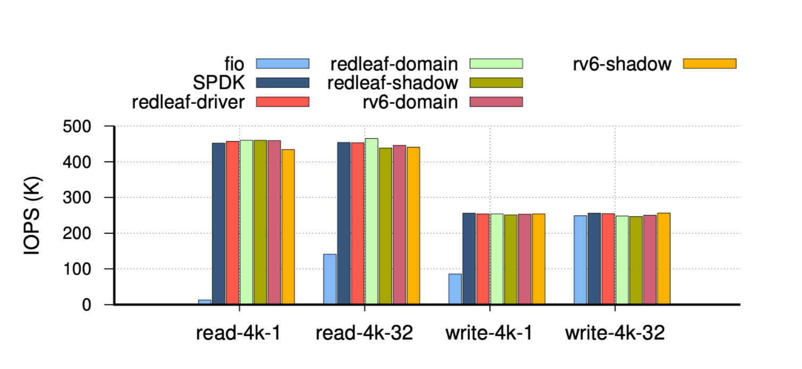

# Lmbench musl result on arm->2*table

|                          test                           |    Linux(raspi board)    |    Safeos(raspi board)     | Safeos-sd card  |
| :-----------------------------------------------------: | :----------------------: | :------------------------: | :-------------: |
|           lmbench_musl lat_syscall -P 1 null            |          2.6150          |           0.6693           |                 |
|           lmbench_musl lat_syscall -P 1 read            |          5.3967          |           0.9464           |                 |
|           lmbench_musl lat_syscall -P 1 write           |          2.9577          |           0.9633           |                 |
|       1 lmbench_musl lat_syscall -P 1 stat /test        |         15.6598          |      858.4286(/test)       |       370       |
|       1 lmbench_musl lat_syscall -P 1 fstat /test       |          5.7010          |           3.5679           |                 |
|        lmbench_musl lat_syscall -P 1 open /test         |         29.7511          |        1272(/test)         |       544       |
|            lmbench_musl lat_sig -P 1 install            |          8.4321          |           4.0625           |                 |
|             lmbench_musl lat_sig -P 1 catch             |         221.0400         |           0.0070           |      Buggy      |
|               lmbench_musl lat_pipe -P 1                |         71.0699          |          34.1217           |                 |
|        lmbench_musl bw_pipe -P 1 -m 1024 -M 1024        |        179.71MB/s        |         131.77MB/s         |                 |
|     lmbench_musl bw_file_rd -P 1 512k io_only /test     |       741.44 MB/s        |        116.99 MB/s         | 0.524288 274.07 |
|   lmbench_musl bw_file_rd -P 1 512k open2close /test    |       655.24 MB/s        |         91.18 MB/s         |      90.91      |
|    lmbench_musl bw_mmap_rd -P 1 512k mmap_only /test    |       4009.85 MB/s       |        2124.49 MB/s        |     2128.99     |
|   lmbench_musl bw_mmap_rd -P 1 512k open2close /test    |         1040.25          |         9.01 MB/s          |      20.76      |
|             lmbench_musl lat_proc -P 1 fork             |         769.6250         |          942.5000          |                 |
|             lmbench_musl lat_proc -P 1 exec             |         997.8333         |         2223.3333          |       989       |
|            lmbench_musl lat_proc -P 1 shell             |        8282.0000         |         2391.0000          |      1068       |
| lmbench_musl lmdd of=/dev/zero move=10m fsync=1 print=3 |       17744 KB/sec       |       3340478 KB/sec       | We have no sync |
|          lmbench_musl lat_pagefault -P 1 /test          |          2.4193          |          194.1595          |       196       |
|          lmbench_musl lat_mmap -P 1 512k /test          |            59            |            781             |       792       |
|                   lmbench_musl lat_fs                   | 0k    61    10696  13463 | 0k      1       57      75 |                 |
|                                                         | 1k    40    6809   10664 | 1k      1       37      72 |                 |
|                                                         | 4k    39    7052   10466 | 4k      1       34      58 |                 |
|                                                         | 10k   26    4633   8701  | 10k     1       34      58 |                 |
|  lmbench_musl lat_ctx -P 1 -s 32 2 4 8 16 24 32 64 96   |         2 24.37          |          2 13.37           |                 |
|                                                         |         4 33.32          |           4 9.73           |                 |
|                                                         |         8 35.36          |           8 8.20           |                 |
|                                                         |         16 52.97         |          16 12.26          |                 |
|                                                         |         24 55.47         |          24 14.94          |                 |
|                                                         |         32 59.54         |          32 21.61          |                 |
|                                                         |         64 68.39         |          64 21.39          |                 |
|                                                         |         96 61.64         |          96 48.25          |                 |


# Lmbench homemade on board->2*table


|                             test                             |         Redox          |           Safeos           |    Safeos sd card(unsafe)    |        linux(single core)        |
| :----------------------------------------------------------: | :--------------------: | :------------------------: | :--------------------------: | :------------------------------: |
|                       Null(micro_sec)                        |         0.660          |           0.679            |            1.593             |              2.602               |
|                        ctx(micro_sec)                        |         7.750          |          363.386           |                              |              19.263              |
|                                                              |                        |                            |                              |                                  |
|                           lat_fs:                            | 这个不对，以之前的为准 |                            | iteration=1000 no path cache |                                  |
|         SIZE(KB)  created(files/s)     time(us/file)         |   1 31.751 31494.971   |     1  56  17553.0074      |     1  44.317 22564.556      |        1 6169.302 162.093        |
|                                                              |   4 31.696 31549.341   |      4 55  17953.517       |     4 32.114  31139.016      |        4 6511.778 153.568        |
|                                                              |   8 29.678 33694.481   |      8 54 18359.9891       |     8 31.484  31762.241      |        8 5322.975 187.865        |
|         SIZE(KB)  deleted(files/s)     time(us/file)         |   1 67.425 14831.191   |       1 93 10660.219       |      1 51.434 19442.309      |        1 11132.155 89.830        |
|                                                              |   4 67.068 14910.211   |       4 93 10665.150       |      4 50.798 19685.946      |        4 11022.458 90.724        |
|                                                              |   8 68.318 14637.411   |       8 93 10662.263       |     8 50.499  19802.363      |        8 9711.579 102.970        |
|                                                              |                        |                            |                              |                                  |
| bw_file_rd open2close filsesize=4KB /tmp.txt (micro_sec,MB/s) |     926.108 4.218      | 869.859 4.597 (25.229 155) |    396.878 9 (14.291 281)    |          45.258 86.356           |
| bw_file_rd io_only filsesize=4KB /tmp.txt  (micro_sec,MB/s)  |     306.169 12.759     |         5.603 696          |        174.319 22.945        |         10.317  378.778          |
|                   Lat_mmap 512K(micro_sec)                   |        104.645         |           58.698           |            14.997            |              36.025              |
|                     lat_pipe( micro_sec)                     |         28.249         |           35.559           |            11.447            | 82.708(异常退出，只跑了一个iter) |
|                    page_fault(micro_sec)                     |        1953.413        |           19.042           |            10.667            |              13.072              |
|                                                              |                        |                            |                              |                                  |
|                    bw_pipe 1024KB 1024MB                     |         51.982         |            578             |           559.098            |             217.537              |
|            bw_mmap_rd 512 mmap_only. (micro_sec)             |        1112.581        |           17.242           |            10.620            |              12.659              |
|            bw_mmap_rd 512 open2close (micro_sec)             |        1842.051        |          1295.477          |           547.786            |              13.072              |
|                                                              |                        |                            |                              |                                  |
|                                                              |                        |                            |              Ss              |                                  |
|                                                              |                        |                            |                              |                                  |
|                                                              |                        |                            |                              |                                  |
|                                                              |                        |                            |                              |                                  |
|                                                              |                        |                            |                              |                                  |
|                                                              |                        |                            |                              |                                  |
|                                                              |                        |                            |                              |                                  |
|                                                              |                        |                            |                              |                                  |
|                                                              |                        |                            |                              |                                  |
|                                                              |                        |                            |                              |                                  |
|                                                              |                        |                            |                              |                                  |

# overhead of Device Memory Cap

## CAP:每个cap选一个test，剩下的放在appendix，1个表

- sd卡驱动使用unsafe或使用cap在lmbench与microbenmark下的开销
  - micro benchmark：测试文件读/写4096B数据开销
  - 测试禁用disk cache，每次读/写操作都访问sd卡
  - Lmbench homemade: bw_file_rd open2close , bw_file_rd io_only

|          baseline:null=0.6x          |      Unsafe      | device memory cap(safe) |         overhead         |
| :----------------------------------: | :--------------: | :---------------------: | :----------------------: |
| homemade bw_file_rd open2close(KB/s) |       581        |           562           |      bw drop: 3.38%      |
|  homemade bw_file_rd io_only(KB/s)   |       1287       |          1208           |      bw drop: 6.54%      |
|    micro_benchmark(write/read us)    | 4171.786 953.780 |    4272.369 1002.141    | lat overhead 2.41%/5.07% |
|    Must: bw_file_rd io_only(MB/s)    |      17.90       |          17.26          |      bw drop: 3.70%      |
|   musl:bw_file_rd open2close(MB/s)   |      13.24       |          12.82          |      bw drop: 3.28%      |

# overhead of frame cap

- 测试mmap，fork，pagefault，enable disk cache and path cache，use RAM disk

|                 Baseline:null=0.6x                 |     Cap      |  No Cap  |  Overhead   |
| :------------------------------------------------: | :----------: | :------: | :---------: |
|       lmbench_musl lat_pagefault -P 1 /test        |   447.1907   | 416.5019 |    7.37%    |
|       lmbench_musl lat_mmap -P 1 512k /test        |     1812     |   1658   |    9.28%    |
| lmbench_musl bw_mmap_rd -P 1 512k mmap_only /test  | 2148.34 MB/s | 2250.97  |    4.78%    |
| lmbench_musl bw_mmap_rd -P 1 512k open2close /test |  9.05 MB/s   |   9.64   |    6.52%    |
|          lmbench_musl lat_proc -P 1 fork           |   942.5000   | 438.6154 | 114.88%(mm) |
|                                                    |              |          |             |
|              Lat_mmap 512K(micro_sec)              |    17.574    |  17.657  |   -0.47%    |
|       bw_mmap_rd 512 mmap_only. (micro_sec)        |    4.410     |  4.371   |    0.89%    |
|       bw_mmap_rd 512 open2close (micro_sec)        |   547.786    | 548.553  |   -0.14%    |
|               page_fault(micro_sec)                |    10.390    |  10.012  |    3.78%    |

# overhead of tcb cap 

- enable disk cache and path cache，use RAM disk

|       Baseline:null=0.6x        |          Cap          |         No Cap         | Overhead |
| :-----------------------------: | :-------------------: | :--------------------: | :------: |
| lmbench_musl lat_proc -P 1 fork | **209.672** **2.069** | **209.589**  **1.664** |  0.04%   |

# overhead of unwind

 

- enable disk cache and path cache，use RAM disk
- 深度=n的递归，每一级分配mKB堆资源.在最后一级函数panic
- Overhead(panic-no_panic)

| Levels(深度)👇/sizekb👉 |    1    |    2    |    4    |    8    |
| :-------------------: | :-----: | :-----: | :-----: | :-----: |
|           1           | 98.041  | 97.634  | 97.641  | 97.633  |
|           2           | 130.679 | 130.699 | 130.682 | 130.686 |
|           4           | 196.739 | 196.737 | 196.760 | 196.743 |
|           8           | 328.697 | 328.816 | 328.808 | 328.754 |

| Levels(深度)👇/sizekb👉 |    1    |    2    |    4    |    8    |
| :-------------------: | :-----: | :-----: | :-----: | :-----: |
|           1           | 228.273 | 227.695 | 227.632 | 227.685 |
|           2           | 304.646 | 304.592 | 304.651 | 304.616 |
|           4           | 458.728 | 458.747 | 458.740 | 458.795 |
|           8           | 766.447 | 766.579 | 766.405 | 766.672 |

# 2-way ipc overhead -> empty trusted_kernel invoke

- lmbench_musl lat_syscall -P 1 null
  - without invoke 0.1892ms
  - with invoke  0.70511ms
  - Overhead 0.52591
- homemade null
  - with invoke: 658
  - without invoke:184
  - overhead: 0.474
- invoke optim: 0.235
  - overhead: 0.051
  - 去掉了invoke在hashmap中查找的开销，在这个测试中为getpid单独开一个lazy_static，不存入GLOBAL_API_RESERVOIR，这样的特制优化可以针对少部分的调用实现。
  - future：使用linktime的类型检查代替runtime的类型检查-->说明技术路线以及可行性

# syscall profiling

## read/write 4k buffer from a file

> disable disk cache, use safe sd_card, unoptimized  invoke 
>
> Use the same homemade test as Device Memory Cap test

- Asm,trap
- Trusted_kernel:96
  - traphandler
  - syscall router->call pm::read
- process manager:556
  - match `filehandle` and `Filelike(v-inode)` from Tcb ->call redoxfs::read
- Redoxfs: `791us`
  - call read_node in a transaction, this will typically reasult in 5  read request sent to sd card driver,each ask for a 4096B size of data.
  - call sdhost::read
- Sdhost: `2196`(5 times)
  - communicate with bcm2835 emmc driver through MMIO regs using device memory cap,
  - 1 read request of a 4K block leads to 8 read requests of 512B block sent to emmc driver

|                Whole                |      2921.803      |
| :---------------------------------: | :----------------: |
|             whole rust              |   174800-175600    |
| usertrap->invoke to pm whole kernel |     96 or 148      |
|              1 invoke               |     512 or 564     |
|  pm::read->invoke to redoxfs:read   | `whole pm 252,304` |
|    whole redoxfs read + Ramdisk     |  `173000-174200`   |
|          1 Ramdisk read :           |        1220        |
|          Redoxfs-5*invoke:          |   164500-165700    |

## pagefault

 


nocap


Write 16153.244 17144.349 17588.060 17134.552 17568.830 17713.947 17516.846 17436.968 17342.587 17732.952 -- **17333.2335** **440.142**


read 3425.845 3754.302 3759.624 3763.832 3747.132 3753.074 3761.489 3762.318 3731.965 3748.023 -- **3720.7604** **98.722**

 

cap 1% faster


write 15836.751 16753.950 16152.646 17217.362 17675.161 17430.038 17394.040 17646.048 17302.912 17871.070 --- **17127.9978**  **638.674**

 

read 3490.444 3491.835 3885.898 3864.990 3867.688 3878.064 3862.086 3885.332 3866.235 3879.006 -- **3797.1578** **153.216**

```
//Redox supported lmbench. These tests are reimplemented in rust 

./lmbench ctx
./lmbench bw_file_rd
./lmbench lat_fs
./lmbench lat_pipe
//./lmbench lat_mmap nKBs mmap_size,default is 4KB 
./lmbench lat_mmap 512
//same as lat_mmap
./lmbench bw_mmap_rd 512 mmap_only
./lmbench bw_mmap_rd 512 open2close
//first arg is packet_size, nKBs,
//second arg is total_bytes,nMBs.
./lmbench bw_pipe 1024 1024
```

# homemade final

## bw

|     Test/mean+std_dev     |                         Description                          |          Redox           |        Safeos        |
| :-----------------------: | :----------------------------------------------------------: | :----------------------: | :------------------: |
|       null syscall        |                       get_pid syscall                        |          0.660           |     0.709,0.916      |
|   bw_file_rd open2close   |   Open a 4KB-sized file, read its contents, then close it.   |  3932.256 118.646 KB/s   |     10762  65.92     |
|    bw_file_rd io_only     |           Bandwidth for reading a 4KB-sized file.            |  12632.959 510.939 KB/s  |     22855.6 2.9      |
| bw_mmap_rd 512 mmap_only  | Bandwidth for map, read every mapped byte, then unmap a 512KB file |      936.048 30.071      |  60469.683 314.060   |
| bw_mmap_rd 512 open2close | Add file opening and closing operations compared to the previous test. |    268.395 0.571 MB/s    |    389.331 0.012     |
|     bw_pipe 1024 1024     | create a pipe between two processes , and moves 1024KB through the pipe in 1024MB chunks |    54.560 0.023 B/us     |      576.2 1.94      |
|          lat_fs           | times how many files can be created or deleted in one second |      iteration=1000      |                      |
|          Create           |                                                              |   33.922 32.784 31.449   | 43.410 31.583 31.352 |
|          delete           |                                                              | 55.893     64.932 62.954 | 58.123 44.975 45.441 |

## lat

|                Test                |                                                              |     Redox     |    Safeos    |
| :--------------------------------: | :----------------------------------------------------------: | :-----------: | :----------: |
|  ./lmbench lat_pipe (mean,stddev)  | uses two processes communicating through a pipe to measure IPC latencies. | 28.070 0.283  | 12.166 0.113 |
| ./lmbench lat_mmap 512 mean stddev |    times how fast a 512KB mapping can be made and unmade.    | 104.470 0.148 | 14.069 0.013 |

# lmbench musl final

## Lat smaller better

|              Mean + std_dev               |                   Safeos                   |    Linux     |             备注             |
| :---------------------------------------: | :----------------------------------------: | :----------: | :--------------------------: |
|    lmbench_musl lat_syscall -P 1 null     |              0.87931  0.36129              |    2.6150    |  Linux的所有测试没有std_dev  |
|    lmbench_musl lat_syscall -P 1 read     |              **1.1444** 0.003              |    5.3967    |                              |
|    lmbench_musl lat_syscall -P 1 write    |             **1.06247** 0.003              |    2.9577    |                              |
| lmbench_musl lat_syscall -P 1 fstat /test |             **1.59731** 0.005              |    5.7010    |                              |
|     lmbench_musl lat_sig -P 1 install     |             **1.74458** 0.004              |    8.4321    |                              |
|        lmbench_musl lat_pipe -P 1         |             **32.6425** 8.437              |   71.0699    |                              |
|      lmbench_musl lat_proc -P 1 exec      |           **997.683** **3.242**            |   997.8333   |                              |
|      lmbench_musl lat_proc -P 1 fork      |           **438.746** **1.603**            |   769.6250   |                              |
|     lmbench_musl lat_proc -P 1 shell      |          **1071.903**  **3.329**           |  8282.0000   |        还需要再测一遍        |
|     lmbench_musl lat_ctx -P 1 -s 32 2     |              **5.673** 0.176               |    24.37     | lat_ctx safeos实现可能有问题 |
|     lmbench_musl lat_ctx -P 1 -s 32 4     |              **4.068**  0.239              |    33.32     |                              |
|     lmbench_musl lat_ctx -P 1 -s 32 8     |            **2.995** **0.372**             |    35.36     |                              |
|    lmbench_musl lat_ctx -P 1 -s 32 16     |            **5.466** **0.916**             |    52.97     |                              |
|    lmbench_musl lat_ctx -P 1 -s 32 24     |            **8.871** **1.612**             |    55.47     |                              |
|    lmbench_musl lat_ctx -P 1 -s 32 32     |            **9.815** **2.391**             |    59.54     |                              |
|   lmbench_musl lat_mmap -P 1 512k /test   |           **746.556** **1.257**            |      59      |                              |
|   lmbench_musl lat_pagefault -P 1 /test   |           **193.661** **0.691**            |    2.4193    |                              |
| lmbench_musl lat_syscall -P 1 stat /test  |           **368.140 ** **0.150**           |   15.6598    |                              |
| lmbench_musl lat_syscall -P 1 open /test  |           **541.527** **0.222**            |   29.7511    |                              |
|    lmbench_musl lat_fs `bigger better`    |                                            |              |                              |
|             0k create\|delete             | **57.1** **10.222** \| **68.8** **11.746** | 10696  13463 |                              |
|             1k create\|delete             |    **39.1** 4.253 \| **64** **11.361**     | 6809   10664 |                              |
|             4k create\|delete             |    35 **3.493** \| **61.778** **6.729**    | 7052   10466 |                              |
|            10k create\|delete             |     **34.6** 4.079 \| **60** **6.229**     | 4633   8701  |                              |

## bw bigger better

|                   Mean + std_dev                   |         Safeos          |  Linux  |            备注             |
| :------------------------------------------------: | :---------------------: | :-----: | :-------------------------: |
|     lmbench_musl bw_pipe -P 1 -m 1024 -M 1024      |   **133.785** 47.120    | 179.71  |                             |
|  lmbench_musl bw_file_rd -P 1 512k io_only /test   |  **276.285** **0.182**  | 741.44  |                             |
| lmbench_musl bw_file_rd -P 1 512k open2close /test |  **92.105** **0.069**   | 655.24  |                             |
| lmbench_musl bw_mmap_rd -P 1 512k mmap_only /test  | **5149.764** **71.672** | 4009.85 | fs相关测试，但性能优于linux |
| lmbench_musl bw_mmap_rd -P 1 512k open2close /test |  **20.997** **0.076**   | 1040.25 |                             |
