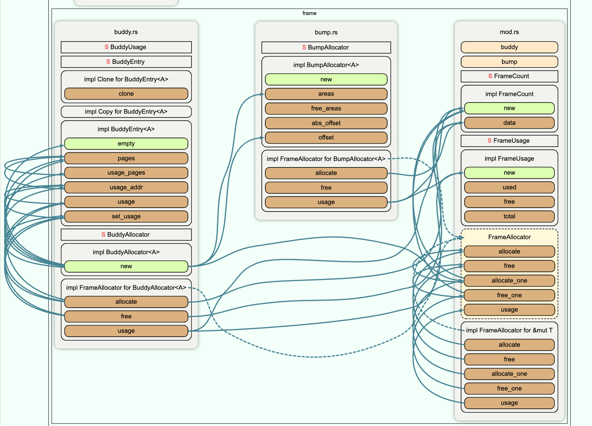
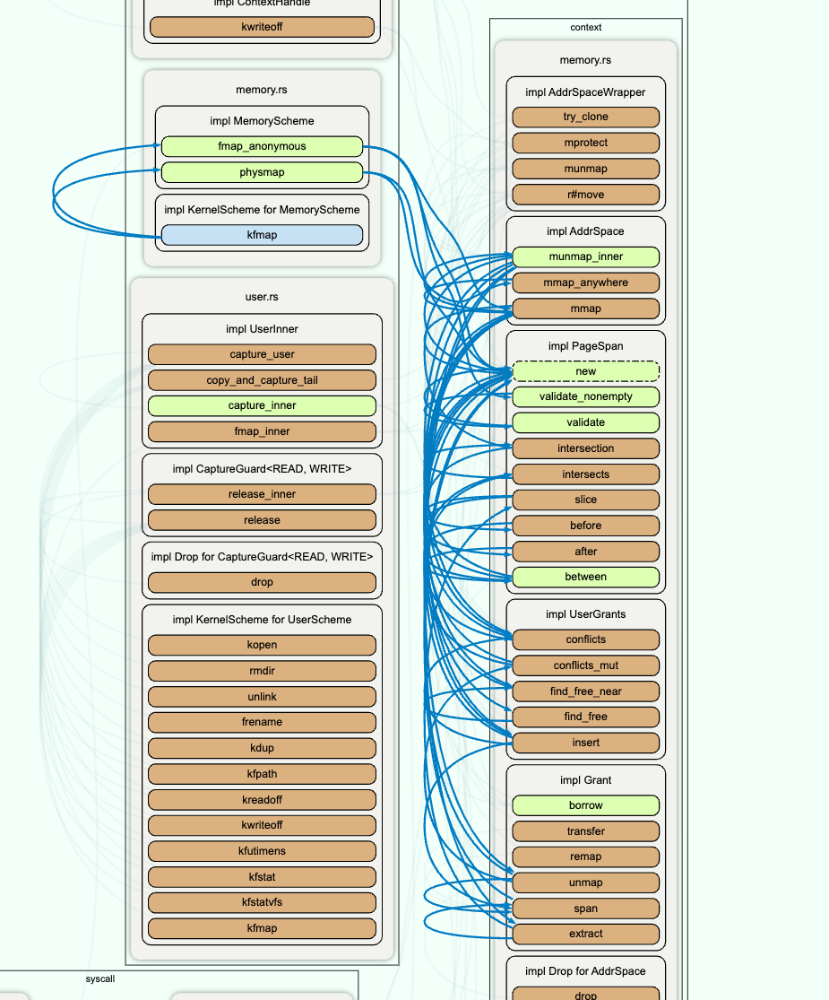

#  需要思考的问题

- redox中的pm mm耦合度较高，且处于同一个crate内部

# MM总体架构

- kernel/src/context/memory.rs:页映射，虚拟页管理，页表管理等
- kernel/src/memory/mod.rs:物理页管理
- Scheme/memory.rs:设计内存管理的系统调用分发

# Frame

## frame allocator

- 实现trait FrameAllocator来进行物理页面分配等
- bump allocator
- buddy allocator
- 使用一个bump allocator初始化一个buddy allocator



## frame的三种形式

## `Frame` 

`Frame` 代表了一个物理内存帧（即内存页），它包含一个 `NonZeroUsize` 类型的物理地址：

```rust
#[derive(Clone, Copy, PartialEq, Eq, Hash, PartialOrd, Ord)]
pub struct Frame {
    physaddr: NonZeroUsize,
}
```

- **`physaddr`**：`NonZeroUsize` 确保这个地址不为零（0x0 通常是保留地址，不能作为有效的物理地址）。

#### `Frame` 的方法

- **`containing(address: PhysicalAddress) -> Frame`**：从给定的物理地址创建一个 `Frame`。它会将地址对齐到页的起始地址，并确保地址不为 0x0。
- **`base(self) -> PhysicalAddress`**：返回帧的基地址（即物理地址）。
- **`range_inclusive(start: Frame, end: Frame)`**：生成一个包含从 `start` 到 `end` 的所有帧的迭代器。
- **`next_by(self, n: usize) -> Self`**：返回当前帧之后的第 `n` 个帧。
- **`offset_from(self, from: Self) -> usize`**：计算当前帧与 `from` 帧之间的偏移量，以页数为单位。
- **`is_aligned_to_order(self, order: u32) -> bool`**：检查当前帧是否按指定的 `order` 对齐。

## `P2Frame` 

`P2Frame` 表示一段连续的物理内存，大小为2^order页

```rust
struct P2Frame(usize);
```

- **`new(frame: Option<Frame>, order: u32) -> Self`**：创建一个 `P2Frame` 实例，低位保存 `order`，高位保存 `frame` 的物理地址。
- **`get(self) -> (Option<Frame>, u32)`**：解析 `P2Frame`，返回 `Frame` 和 `order` 的元组。
- **`frame(self) -> Option<Frame>`** 和 **`order(self) -> u32`**：分别返回 `Frame` 和 `order`。

##  `RaiiFrame` 

`RaiiFrame` 使用 RAII 模式管理 `Frame` 的生命周期：

```rust
#[derive(Debug)]
pub struct RaiiFrame {
    inner: Frame,
}
```

- 封装一个Frame，类似theseus的做法
- **`allocate() -> Result<Self, Enomem>`**：分配一个新的 `RaiiFrame`，如果分配失败则返回 `Enomem` 错误。
- **`new_unchecked(inner: Frame) -> Self`**：不进行任何检查直接创建一个 `RaiiFrame`（这是不安全的，因为它跳过了引用计数检查）。
- **`get(&self) -> Frame`**：返回内部的 `Frame`。

#### `Drop` 实现

```rust
impl Drop for RaiiFrame {
    fn drop(&mut self) {
        if get_page_info(self.inner)
            .expect("RaiiFrame lacking PageInfo")
            .remove_ref()
            == None
        {
            unsafe {
                deallocate_frame(self.inner);
            }
        }
    }
}
```

- **`drop(&mut self)`**：当 `RaiiFrame` 被销毁时，检查帧的引用计数，如果引用计数为零则释放该帧。

# MAPPING

- 这部分位于context/memory.rs,负责页面映射等工作

### **AddrSpace**，一个process的内存空间

```rust
pub struct AddrSpace {
    pub table: Table,
    pub grants: UserGrants,
    pub used_by: LogicalCpuSet,
    pub mmap_min: usize,
}
```


`AddrSpace` 结构体表示一个地址空间，包含了页面表、内存区域（grants）等信息。

- `table`: `Table` 类型，包含页表映射信息。
- `grants`: `UserGrants` 类型，管理用户授予的内存区域。
- `used_by`: 表示当前地址空间被哪些 CPU 使用。
- `mmap_min`: 最小的内存映射地址，用于防止低地址映射的安全问题。


- `new()`: 初始化一个新的地址空间。
- `mmap_anywhere()`, `mmap()`: 用于映射内存。
- `munmap_inner()`: 内部解除映射操作。

### **UserGrants**

```rust
pub struct UserGrants {
    inner: BTreeMap<Page, GrantInfo>,
    holes: BTreeMap<VirtualAddress, usize>,
    pub funmap: HashMap<Page, (usize, Page)>,
}
```

#### 作用：
`UserGrants` 结构体管理与用户相关的内存授予（grants），如用户态进程使用的内存区域。

- `inner`: 使用 `BTreeMap` 来管理内存区域，`Page` 是内存区域的起始页。
- `holes`: 管理可用的地址空间区域（洞），用于快速分配内存。
- `funmap`: 维护映射页与其相关的文件映射信息。

#### 主要方法：
- `contains()`: 检查给定页面是否在某个授予的内存区域内。
- `conflicts()`, `conflicts_mut()`: 查找与给定内存区域冲突的所有内存授予区域。
- `find_free_near()`, `find_free()`: 查找合适大小的空闲内存区域。
- `insert()`, `remove()`: 插入或移除一个内存授予区域。

### **GrantInfo**

```rust
pub struct GrantInfo {
    page_count: usize,
    flags: PageFlags<RmmA>,
    mapped: bool,
    pub(crate) provider: Provider,
}
```

#### 作用：
`GrantInfo` 结构体描述了内存授予区域的详细信息。

- `page_count`: 内存区域包含的页数量。
- `flags`: 内存区域的访问权限标志（如读、写、执行）。
- `mapped`: 表示这个内存区域是否已经映射到物理内存。
- `provider`: 内存的提供者，可能是已分配的内存、共享内存或外部的物理内存等。

#### 主要方法：
- `is_pinned()`: 检查这个区域是否已被固定（不能解除映射）。
- `can_extract()`: 检查是否可以从这个区域中提取子区域。
- `unpin()`: 解除固定状态。
- `flags()`: 返回这个区域的权限标志。

### Provider

```rust
pub enum Provider {
    Allocated { cow_file_ref: Option<GrantFileRef>, phys_contiguous: bool },
    AllocatedShared { is_pinned_userscheme_borrow: bool },
    PhysBorrowed { base: Frame },
    External { address_space: Arc<AddrSpaceWrapper>, src_base: Page, is_pinned_userscheme_borrow: bool },
    FmapBorrowed { file_ref: GrantFileRef, pin_refcount: usize },
}
```

#### 作用：
`Provider` 枚举表示内存授予区域的不同提供方式，决定了这个区域如何管理。

- `Allocated`: 普通的分配内存，可能是 CoW（Copy on Write）机制。
- `AllocatedShared`: 共享内存。
- `PhysBorrowed`: 直接借用的物理内存。
- `External`: 从另一个地址空间借用的内存。
- `FmapBorrowed`: 从文件映射的共享内存。

### Table

```rust
pub struct Table {
    pub utable: PageMapper,
}
```

#### 作用：
`Table` 结构体表示一个页表，管理地址空间的内存映射。

- `utable`: `PageMapper` 类型，用于实际的页表操作。

#### 主要方法：
- `setup_new_utable()`: 根据不同的架构，初始化新的用户页表。


# MAPPER

#### `PageMapper<A, F>`

`PageMapper` 结构体包含以下字段：

- `table_kind`: `TableKind` - 表示页表的类型，可能是用户表或内核表。
- `table_addr`: `PhysicalAddress` - 表示页表的物理地址。
- `allocator`: `F` - 用于分配和释放物理内存页的分配器。
- `_phantom`: `PhantomData<fn() -> A>` - 使用 `PhantomData` 确保 `PageMapper` 结构体是类型安全的，而无需实际存储 `A` 的实例。

#### 主要方法

- `new`: 静态方法，用于创建 `PageMapper` 实例，设置页表的类型和物理地址，初始化分配器。
- `create`: 静态方法，用于分配一个新的页表并创建 `PageMapper` 实例。
- `current`: 静态方法，返回当前正在使用的页表的 `PageMapper`。
- `is_current`: 判断当前 `PageMapper` 是否与系统中正在使用的页表相同。
- `make_current`: 将当前 `PageMapper` 设置为系统的当前页表。
- `table`: 返回当前 `PageMapper` 所代表的页表的 `PageTable` 实例。
- `allocator` 和 `allocator_mut`: 返回分配器的不可变或可变引用。
- `map_phys`: 将给定的物理地址映射到给定的虚拟地址，设置相应的页面标志，并返回 `PageFlush` 用于刷新页表。
- `remap_with_full`, `remap_with`, `remap`: 重新映射一个虚拟地址到可能的新物理地址或使用新的页面标志，并返回旧的映射信息。
- `map_linearly`: 将一个物理地址线性映射到相同的虚拟地址。
- `translate`: 将虚拟地址翻译为物理地址及其相关的页面标志。
- `unmap` 和 `unmap_phys`: 取消虚拟地址的映射，并释放相关的物理内存。

## trait arch

- 可以直接复用
- redox对sv39实现了arch trait
- trait包含内存管理相关的常量和工具函数
- 这个trait属于redox对体系结构的封装之一

# function call graph

## scheme-memory

- 调用下层的mmap接口

