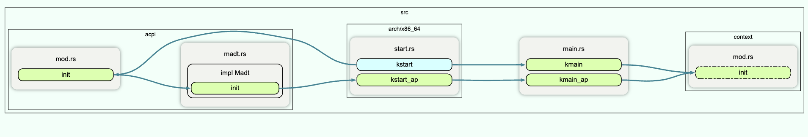
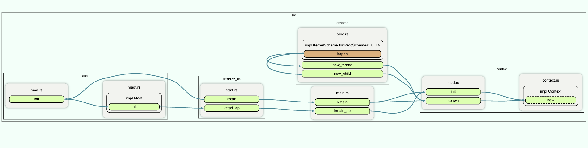

- context switch
- init
- create a new thread


>All contexts except kmain will primarily live in userspace, and enter the kernel only when interrupts or syscalls occur.

# PM MM 接口

## PM to MM

- spawn

|        PM        |                        MM                         |
| :--------------: | :-----------------------------------------------: |
| set_addr_space() |       这个函数初始化的数据结构在PM中被定义        |
|   Kstak::new()   | 初始化一个内核栈，使用allocate_p2frame,分配物理页 |
|  ::initial_top   |      使用rmm_repo中的phys2virt，转为虚拟地址      |

- kfmap:将进程a内存空间的指定区域映射至进程b
  - 在syscall dispatch时调用pm与mm提供的接口


# switch

这个代码片段实现了一个上下文切换的机制，通常用于操作系统内核中的任务调度。代码实现了进程的上下文切换、时间片调度等核心功能。下面是对这个代码的解析：

### 1. **上下文切换 (`switch` 函数)**
   `switch` 函数负责从当前正在运行的进程切换到下一个可运行的进程。核心流程如下：

   - **时间片管理**：每个进程分配了固定数量的 PIT 中断计数 (`pit_ticks`) 来进行调度，`tick` 函数会在每次中断时递增 `pit_ticks`，并在 `pit_ticks >= 3` 时触发上下文切换。

   - **全局锁**：通过设置一个全局锁 (`CONTEXT_SWITCH_LOCK`)，避免上下文切换过程中出现并发问题。在获取锁之前，系统会通过 `interrupt::pause()` 进入低功耗等待状态，同时处理可能的 TLB shootdown。

   - **上下文选择**：通过遍历所有上下文（`contexts`），寻找下一个可运行的上下文。具体而言，代码会通过 `update_runnable` 函数更新并检查上下文状态是否可运行。若找到可运行的上下文，则会切换到该上下文。

   - **状态更新**：上下文切换前，会更新当前上下文的状态（如 `cpu_time` 和 `running` 标志）。切换到下一个上下文后，更新其 CPU ID 和运行时间戳。

   - **上下文切换**：通过 `arch::switch_to` 调用体系结构特定的代码，完成底层的上下文切换操作。之后，代码不会立即返回原函数，而是会通过 `switch_finish_hook` 清理上下文切换的状态。

### 2. **`ContextSwitchPercpu` 结构体**
   这是一个 per-CPU（每个 CPU 独立）的结构体，保存了与上下文切换相关的 per-CPU 数据：

   - **`switch_result`**：保存了最近一次上下文切换的结果，用于在上下文切换结束后释放锁。
   
   - **`pit_ticks`**：记录了当前上下文的 PIT 中断计数，用于时间片调度。
   
   - **`current_ctxt`**：保存当前正在运行的上下文（`Context`）。
   
   - **`idle_ctxt`**：保存空闲上下文（`idle context`），当没有可运行的进程时，CPU 将切换到这个空闲上下文。
   
   - **`being_sigkilled`**：指示当前上下文是否被信号杀死。

### 3. **`update_runnable` 函数**
   这个函数的主要作用是更新上下文的状态并判断其是否可运行：

   - **忽略正在运行的上下文**：如果上下文已经在运行，则跳过。
   
   - **忽略分配给其他 CPU 的上下文**：如果上下文被绑定到其他 CPU，则跳过。

   - **从休眠中唤醒上下文**：如果上下文处于软阻塞状态（例如睡眠状态），且已达到唤醒时间，则将其唤醒。

   - **判断是否可运行**：如果上下文状态更新后处于可运行状态，则返回 `UpdateResult::CanSwitch`，否则返回 `Skip`。

### 4. **锁管理**
   代码中大量使用了 `RwSpinlock` 锁来保护上下文（`Context`）的并发访问。每个上下文切换时都会获取当前上下文和下一个上下文的写锁 (`write_arc`)，确保在进行切换时不会发生数据竞争。

### 5. **系统调用追踪 (`ptrace`)**
   在上下文切换时，代码还处理了与系统调用追踪（`ptrace`）相关的状态，确保跟踪调试器的正确性。具体操作包括设置 `ptrace_flags` 和更新 `ptrace_session`。

### 6. **上下文切换钩子 (`switch_finish_hook`)**
   这个函数是在上下文切换完成后调用的，主要用于清理上下文切换的状态，释放锁。如果没有上下文切换结果（即异常情况），系统会执行紧急重置。

### 7. **其他细节**
   - **任务调度器**：这个代码实现了一个循环调度器，通过遍历所有上下文来选择下一个可运行的上下文。
   - **时间片调度**：使用 PIT 中断来实现时间片调度，确保每个进程获得公平的 CPU 时间。

### 总结
该代码实现了操作系统中的核心上下文切换逻辑，包括时间片调度、上下文状态管理和多 CPU 支持。上下文切换是通过遍历所有上下文来选择下一个可运行的上下文，并通过体系结构特定的代码来完成切换。同时，代码还处理了与系统调用跟踪和信号处理相关的状态更新。

# init

1. **初始化 (`init`)**：

   - `init` 函数负责初始化主进程和主上下文 (`kmain`)，并设置与 CPU 相关的上下文切换数据结构。
   - 该函数创建了一个 `kmain` 进程，设置其 CPU 亲和性（`sched_affinity`），并将其上下文状态标记为 `Runnable`，表示可以调度执行。
   - 初始化完成后，`kmain` 上下文被加入全局的上下文集合（`CONTEXTS`），并设置为当前 CPU 的上下文。

   **上下文管理**：

   - `contexts()` 和 `contexts_mut()` 分别返回全局上下文集合的只读和可写锁定。
   - `current()` 返回当前正在执行的上下文的引用。
   - `is_current()` 判断给定的上下文是否为当前上下文。
   - `current_pid()` 返回当前上下文的进程 ID。

   **上下文引用 (`ContextRef`)**：

   - `ContextRef` 是一个对上下文的封装，它提供了 `upgrade` 方法用于获取强引用，以及实现了比较和相等操作符，以便在集合中存储和管理上下文。

   

   ### `Context` 结构体

   这个结构体包含多个字段，用于描述进程或线程的各种属性和状态：

   - **基本信息：**
     - `pid`: 进程 ID，用于唯一标识这个进程。
     - `process`: 一个指向进程状态的共享指针，通过 `Arc<RwLock<Process>>` 类型来实现线程安全的共享访问。
     - `sig`: 信号处理状态，包含 `Option<SignalState>`，用于管理进程信号相关的信息。
     - `status`: 当前上下文的状态，如运行中、阻塞中等。
     - `status_reason`: 描述当前状态的原因（如阻塞的原因）。

   - **调度相关：**
     - `running`: 标志上下文是否正在运行。
     - `cpu_id`: 当前分配的 CPU ID，如果有的话。
     - `switch_time`: 上下文切换到这个进程的时间。
     - `cpu_time`: 这个上下文使用的 CPU 时间总量。
     - `sched_affinity`: 调度的 CPU 亲和性，用于限制这个上下文可以在哪些 CPU 上运行。

   - **系统调用相关：**
     - `inside_syscall`: 标志上下文是否正在处理系统调用。
     - `syscall_head` 和 `syscall_tail`: 用于处理非页面对齐的系统调用缓冲区。

   - **其他字段：**
     - `wake`: 上下文应该在特定时间唤醒。
     - `arch`: 架构特定的上下文信息。
     - `kfx`: 用于在上下文切换时保存 SIMD 和 FPU 寄存器。
     - `kstack`: 如果位于堆上的内核栈。
     - `addr_space`: 地址空间，包含页面表锁和权限信息。
     - `name`: 上下文的名称。
     - `files`: 打开文件的描述符表。
     - `userspace`: 标志上下文是否主要运行在用户态。
     - `being_sigkilled`: 标志上下文是否正在被信号终止。
     - `fmap_ret`: 用于存储与帧映射相关的返回值。

   ### `Context` 的方法

   - **阻塞和解阻塞：**
     - `block` 和 `hard_block`：将上下文标记为阻塞状态，并记录阻塞的原因。
     - `unblock` 和 `unblock_no_ipi`：将上下文从阻塞状态标记为可运行状态。

   - **文件操作：**
     - `add_file` 和 `add_file_min`：将文件描述符添加到上下文的文件表中。
     - `get_file`：获取指定的文件描述符。
     - `insert_file`：在特定位置插入文件描述符（如 `dup2` 系统调用）。
     - `remove_file`：移除文件描述符。

   - **地址空间操作：**
     - `addr_space` 和 `set_addr_space`：获取和设置上下文的地址空间。

   - **寄存器访问：**
     - `regs` 和 `regs_mut`：用于访问或修改上下文的中断栈（即寄存器的状态）。

   - **信号控制：**
     - `sigcontrol` 和 `sigcontrol_raw`：用于访问信号控制的相关数据。

   # create a new thread

   **上下文创建 (`spawn`)**：

   - `spawn` 函数用于创建一个新的上下文。它接收一个布尔值 `userspace_allowed`，表示是否允许该上下文运行在用户空间，以及关联的进程和一个函数指针。
   - 该函数为新上下文分配内核栈（`Kstack`），并根据目标架构设置不同的寄存器和堆栈布局。
   - 新的上下文创建后，会被添加到全局上下文集合（`CONTEXTS`）中，并更新到对应进程的线程列表中。



# unsafe

## switch.rs

- unsafe fn update_runnable(context: &**mut** Context, cpu_id: LogicalCpuId) -> UpdateResult
  - 更新传入的context状态，判断是否为runnable并赋值
- pub unsafe **extern** "C" fn switch_finish_hook()
  - 用于清理上下文切换的状态，释放锁
- switch()
  - mem::transmute
  - arch::switch_to
  - Set_current_context

## mod.rs

- Init()
  - Init pm. spawn thread "kmain"
- Spawn()
  - 设置用户栈
  - 设置入口点

## context.rs

- set_addr_space
  - 设置线程的地址空间
- regs()&&regs_mut()
  - 操作内核栈
- sigcontrol
  - 处理信号控制相关的逻辑，通过引用和解引用信号控制相关的内存来获取进程和线程的信号控制信息
- Kstack 
  - 初始化内核栈，drop时unmap内核栈


#  sel4-初始化一个TCB

## alloc tcb cap

```c
static inline int vka_alloc_tcb(vka_t *vka, vka_object_t *result)
{
    return vka_alloc_object(vka, seL4_TCBObject, seL4_TCBBits, result);
}
```

- cspace中分配一个节点，填写相关信息
- 分配相应的内存-> untype_retype
- 返回result，已分配的cap

## configure a tcb

static inline int seL4_TCB_Configure->seL4_call_with_MRs

| Name       | Type             | Description                                                  |
| ---------- | ---------------- | ------------------------------------------------------------ |
| seL4_TCB   | _service         | Capability to the TCB which is being operated on.            |
| seL4_Word  | fault_ep         | CPTR to the endpoint which receives IPCs when this thread faults. This capability is in the CSpace of the thread being configured. |
| seL4_CNode | cspace_root      | The new CSpace root.                                         |
| seL4_Word  | cspace_root_data | Optionally set the guard and guard size of the new root CNode. If set to zero, this parameter has no effect. |
| seL4_CPtr  | vspace_root      | The new VSpace root.                                         |
| seL4_Word  | vspace_root_data | Has no effect on x86 or ARM processors.                      |
| seL4_Word  | buffer           | Location of the thread’s IPC buffer. Must be 512-byte aligned. The IPC buffer may not cross a page boundary. |
| seL4_CPtr  | bufferFrame      | Capability to a page containing the thread’s IPC buffer.     |

- 设置cspace,vspace

  ```c
  cRootSlot  = current_extra_caps.excaprefs[0];
  cRootCap   = current_extra_caps.excaprefs[0]->cap;
  vRootSlot  = current_extra_caps.excaprefs[1];
  vRootCap   = current_extra_caps.excaprefs[1]->cap;
  bufferSlot = current_extra_caps.excaprefs[2];
  bufferCap  = current_extra_caps.excaprefs[2]->cap;
  ```

- 将tcb/vspace/cspace的cap插入cspace中

## 设置thread Context

- 配置Sel4_userContext
- 入口点:`regs->pc = value;`
- 栈指针:`regs->sp = value;`

- seL4_TCB_WriteRegisters,将配置的context写入tcb
  - seL4_CallWithMRs,label=TCBWriteRegisters
  - 设置对方tcb->arch中的context

## 设置thread为runnable

- seL4_TCB_Resume(seL4_TCB service)
  - seL4_CallWithMRs,label=TCBResume
- 设置线程状态为：ThreadState_Restart
- 加入调度队列
- possible_switch_to

# 可以被用在safeos中的sel4接口

tcb_new