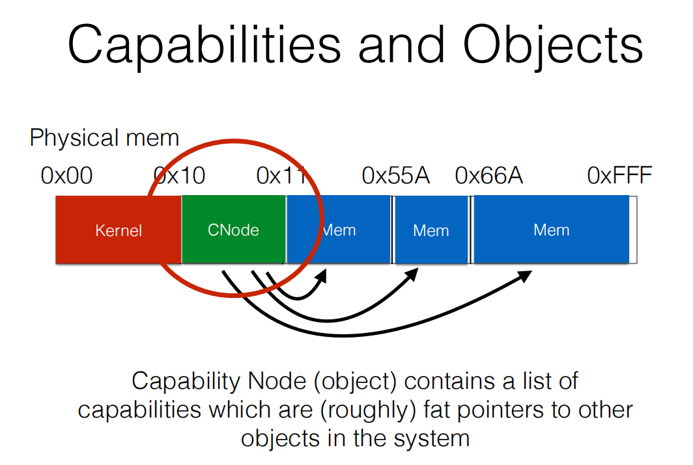
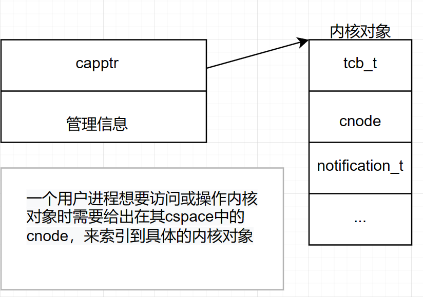

# SEL4 kernel code notes

- [ ] 中断源码
- [ ] ntfn源码
- [ ] 两篇基于faas论文的概念
- [ ] sel4+faas论文的实现结构

[TOC]


# CAPABILITIES

对用户来说，capabilities对内核对象直接在物理内存层面进行管理。



一个cnode包含了一个胖指针数组，每个胖指针都指向系统中的一个内核对象。

capabilities本质上是一个access token，如下图所示



## 解构CNODE

> A CNode is a table of slots, each of which may contain a capability. This may include capabilities to further CNodes, forming a directed graph.
>

其中，一个slot也被称为一个CTE,包含cap_t和mdb_node_t,cap_t的类型有多种，下面以cnode_cap为例解构了cap_t的一种组成方式。当一个cte中存的cap类型为cnode时，这个cnode又指向一个cte数组，可以继续寻址；存的是其他类型cap时，代表这是某一thread拥有的某个kernel_object的cap。


```c
cte:
struct cte {
    cap_t cap;              /*Z u64[2] */
    mdb_node_t cteMDBNode;  /*Z u64[2] */
};
typedef struct cte cte_t; 

cap_t:
struct cap {
    uint64_t words[2];
};
typedef struct cap cap_t;

mdb_node_t:
struct mdb_node {
    uint64_t words[2];
};
typedef struct mdb_node mdb_node_t;

structure：
block mdb_node {
    padding 16
    field_high mdbNext 46
    field mdbRevocable 1
    field mdbFirstBadged 1
    field mdbPrev 64
}
```

一个cte图示，以untyped_cap为例


以cnode_cap为例展示其结构，其余结构(其他内核对象的cap)均类似

cnode_cap结构：`在代码实现中word[0]和word[1]是倒置的`


```
block cnode_cap(capCNodeRadix, capCNodeGuardSize, capCNodeGuard,
                capCNodePtr, capType) {
    field capCNodeGuard 64 具体的guard数值；
    field capType 5 
    field capCNodeGuardSize 6 guard占的位数；
    field capCNodeRadix 6 CNode的最大slot个数；
    field_high capCNodePtr 47 指向CNode的指针；
}
```

一个cnode_cap可以理解为封装了指向cte数组指针(capCNodePtr)的数据结构，也即fat pointer，提供一些管理信息。

## CNODE创建

> CNode must be created by calling seL4_Untyped_Retype() 
>
> The caller must therefore have a capability to enough untyped memory as well as enough free capability slots available in existing CNodes for the seL4_Untyped_Retype() invocation to succeed

关于untyped_retype的讲解见后文。

### 第一个CNODE

在init_thread被创建的时候，其tcb_t内的cnode已经被初始化，部分初始化的cslot如下所示


**最开始Thread中CSPACE的布局，蓝色线是tutorial中第一个cnodecopy的操作**，包括cnode复制和mdb_node的赋值


> 对于一个thread来说，在初始化时tcb_t内自带一个cslot数组，部分slot被初始化为不同的cap。在第一个cslot中存放的是`tcbCTable`(ctable)，代表这个thread的Cspace root，是一个cnode_cap。这个cap中的cnode指向的cslot数组才是上述图中的initial thread's CNode content.

## CNODE相关method

- **seL4_CNode_Mint()**:从现有cap创建一个新的cap
- **seL4_CNode_Copy()** :
- **seL4_CNode_Mutate()** 
- **seL4_CNode_Rotate()**
- **seL4_CNode_Delete()** 
- **seL4_CNode_Revoke()** 
- **seL4_CNode_SaveCaller()**
- **seL4_CNode_CancelBadgedSends()** 

### seL4_CNode_Mint调用流程

**用户：**

`seL4_CNode_Mint`(seL4_CNode _service, seL4_Word dest_index, seL4_Uint8 dest_depth, seL4_CNode src_root, seL4_Word src_index, seL4_Uint8 src_depth, seL4_CapRights_t rights, seL4_Word badge)

- `_service`,`dest_index`,`dest_depth`:destination cspace root cnode，index,depth
- src_root,index,depth: source cspace root cnode，index,depth
- seL4_CapRights_t `rights`:新cnode的权利
- seL4_Word `badge`:给endpoint用的badge

调用实例：

```c
seL4_CNode_Copy(seL4_CapInitThreadCNode, first_free_slot, seL4_WordBits,
                seL4_CapInitThreadCNode, seL4_CapInitThreadTCB, seL4_WordBits,
                seL4_AllRights,0);
```

- depth统一为64
- source和dest的都为本thread的root_cnode_cap`seL4_CapInitThreadCNode=2`
- `seL4_CapInitThreadTCB`为sourceslot，是tcb_cap
- `first_free_slot`是第一个空槽，是dest

------

`seL4_CallWithMRs`(_service, tag,&mr0, &mr1, &mr2, &mr3);

- tag是`seL4_MessageInfo_new`(CNodeMint, 0, 1, 6);用于存放要唤醒的函数类型(label)以及消息寄存器个数等
- mr0：dest_index,mr1:dest_depth
- mr2:src_index,mr3:src_depth
- mr4:rights,mr5:badge

------

`x64_sys_send_recv`(seL4_SysCall, dest, &dest, msgInfo.words[0], &info.words[0], &msg0, &msg1, &msg2, &msg3, 0);

转到内核的系统调用处理函数

------

**内核：**

SLOWPATH:

```c
void NORETURN slowpath(syscall_t syscall)//省略了一些判断
{
    ksKernelEntry.is_fastpath = 0;
    handleSyscall(syscall);//syscall_handler
    restore_user_context();//释放锁并恢复用户上下文：或处理等待的中断、或恢复虚拟机、或系统调用和中断返回
    UNREACHABLE();
}
```

------

根据syscall类型选择不同的处理路径，这里是`SysCall`，调用handleinvocation，再调用decodeinvocation

```c
exception_t handleSyscall(syscall_t syscall){
    case SysCall:
    ret = handleInvocation(true, true, true, false, getRegister(NODE_STATE(ksCurThread), capRegister));
    //省略出错处理
    break;
}
/*Z 处理主动类系统调用
Send:   false, true
NBSend: false, false
Call:   true,  true */
static exception_t handleInvocation(bool_t isCall, bool_t isBlocking){//true,true
	thread = NODE_STATE(ksCurThread);//拿到当前cpu的信息？我感觉是啥也没改，原路返回，thread=ksCurThread
    //get register是拿到在x86指令集下syscall这个指令传递的一些参数，不是mr们，这里拿到第三个reg的内容，就是info.word[0]
    info = messageInfoFromWord(getRegister(thread, msgInfoRegister));
    cptr_t cptr = getRegister(thread, capRegister);/*Z 使用的CSlot句柄,拿到dest_capptr(2) */
    /*Z 查找CSlot句柄指示的能力和CSlot */
    /* faulting section */
    lu_ret = lookupCapAndSlot(thread, cptr);
    /*Z 查找当前线程的IPC buffer */
    buffer = lookupIPCBuffer(false, thread);
    /*Z 在当前线程CSpace中按机器字深度查找额外能力CSlot指针，赋予全局变量 */
    status = lookupExtraCaps(thread, buffer, info);
    /* Syscall error/Preemptible section */
    length = seL4_MessageInfo_get_length(info);
    if (unlikely(length > n_msgRegisters && !buffer)) {
        length = n_msgRegisters;
    }
    status = decodeInvocation(seL4_MessageInfo_get_label(info), length,
                              cptr, lu_ret.slot, lu_ret.cap,
                              current_extra_caps, isBlocking, isCall,
                              buffer);
}
```

`lookupCapAndSlot`使用tcb和一个cnode_cap(实际是在tcb的cslot中的偏移，本例中为2)进行寻址，调用路径为

> lookupCapAndSlot(tcb_t *thread, cptr_t cPtr)`->`lookupSlot(thread, cPtr);`->`resolveAddressBits(threadRoot, capptr, wordBits);

这一段路径是内核代码对某一个tcb的cnode寻址的路径

## CNODE寻址(lookupcapandslot)

`resolveAddressBits` in `cspace.c`

```C
resolveAddressBits_ret_t resolveAddressBits(cap_t nodeCap, cptr_t capptr, word_t n_bits){
    while (1) {
        //radixbits是这个cnode对应的cslot的索引位位数
        offset = (capptr >> (n_bits - levelBits)) & MASK(radixBits);/*Z 获取capptr中的索引值 */
        //cap_cnode_cap_get_capCNodePtr找到capNodeptr并返回，也即找到所指向的数组首地址
        slot = CTE_PTR(cap_cnode_cap_get_capCNodePtr(nodeCap)) + offset;/*Z 获取该索引值对应的CSlot */
        if (likely(n_bits <= levelBits)) {/*Z 解析位恰好用完(小于的情况上面已排除)，结束 */
            ret.status = EXCEPTION_NONE;
            ret.slot = slot;
            ret.bitsRemaining = 0;
            return ret;
        }
        /*Z 递进至下一级 */
        n_bits -= levelBits;
        nodeCap = slot->cap;
        /*Z 下一级的能力不是CNode能力，则此“下一级”是叶子CSlot，结束 */
        if (unlikely(cap_get_capType(nodeCap) != cap_cnode_cap)) {
            ret.status = EXCEPTION_NONE;
            ret.slot = slot;
            ret.bitsRemaining = n_bits;
            return ret;
        }
    }
}
```

根据传入的nodecap，index(capptr)和depth(n_bits)寻找对应的cnode。其过程就相当于指针数组寻址，根据一个给定的偏移和搜索深度进行寻址，可能有多层数组需要寻找。

------

`decodeInvocation`,根据传入的cap来决定执行什么操作，这里是`cap_cnode_cap`

```
exception_t decodeInvocation(word_t invLabel, word_t length,/*Z 系统调用传入的当前线程参数： 消息标签(错误类型)、长度 */
                             cptr_t capIndex, cte_t *slot, cap_t cap,/*Z CSlot句柄、CSlot(包含cnode和mdbnode)、能力(槽中包含的那个cnode) */
                             extra_caps_t excaps, bool_t block, bool_t call,/*Z 额外能力、是否阻塞、是否Call调用 */
                             word_t *buffer)/*Z IPC buffer */
{
 	switch (cap_get_capType(cap)) {
 	...
    case cap_cnode_cap:
    	return decodeCNodeInvocation(invLabel, length, cap, excaps, buffer);
    ...
    	}
}

```


------

```c
/*Z 引用cap_cnode_cap能力的系统调用 */
exception_t decodeCNodeInvocation(word_t invLabel, word_t length, cap_t cap,/*Z 消息标签、长度、能力 */
                                  extra_caps_t excaps, word_t *buffer)/*Z 额外能力、IPC buffer */
{
	index = getSyscallArg(0, buffer);/*Z消息传参(公共部分)：0-要操作的目标能力句柄 */
    w_bits = getSyscallArg(1, buffer);/*Z 1-句柄深度。不能为0 */
    /*Z 查找要操作能力句柄指代的能力 */
    lu_ret = lookupTargetSlot(cap, index, w_bits);//dest
    destSlot = lu_ret.slot;
    srcIndex = getSyscallArg(2, buffer);/*Z 消息传参(个例部分)：2-源能力句柄 */
    srcDepth = getSyscallArg(3, buffer);/*Z 3-句柄深度 */
	srcRoot = excaps.excaprefs[0]->cap;/*Z extraCaps0-源CNode */
	lu_ret = lookupSourceSlot(srcRoot, srcIndex, srcDepth);
    srcSlot = lu_ret.slot;
	//然后根据invlabel选择要做的操作
	switch (invLabel) {
	 case CNodeMint:/*Z子功能：制作(拷贝并修改)能力 */
            cap_rights = rightsFromWord(getSyscallArg(4, buffer));/*Z消息传参：4-新能力权限 */
            capData = getSyscallArg(5, buffer);/*Z 5-新能力的可更新参数 */
            srcCap = maskCapRights(cap_rights, srcSlot->cap);/*Z 根据新权限设置能力最后的权限，只减不增 */
            /*Z 返回拷贝(导出)的能力。基本是原能力，要作一些排错、复位等处理 */
            dc_ret = deriveCap(srcSlot,updateCapData(false, capData, srcCap));
            newCap = dc_ret.cap;
            isMove = false;
            break;
	}
	setThreadState(NODE_STATE(ksCurThread), ThreadState_Restart);
	//ismove=false
	if (isMove) {/*Z 移动CSlot(目标使用新能力) */
        return invokeCNodeMove(newCap, srcSlot, destSlot);
    } else {/*Z 源、目的CSlot建立关联，并将新能力拷贝到目的CSlot。目的CSlot必须为空能力 */
        return invokeCNodeInsert(newCap, srcSlot, destSlot);
    }
}
```

> __`lookupTargetSlot(cap, index, w_bits);`和`lookupSourceSlot(srcRoot, srcIndex, srcDepth);`传入的第一个参数均是cap_t类型的，是实打实的cap，而不是需要寻址的东西。这第一个参数就是root，后两个参数代表在root内寻址，本例中，sourceroot(srcRoot)和destroot(cap)均是tcb cspace中的第三项seL4_CapInitThreadCNode,`指向tcb_cspace首地址`。sourceindex是seL4_CapInitThreadTCB，destindex(1)是first_free_slot(409).上述两个函数就是找到src和destindex索引到的cslot并返回__

------

invokecnodeinsert->cteinsert

```c
/*Z 源、目的CSlot建立关联，并将新能力拷贝到目的CSlot。目的CSlot必须为空能力 */
exception_t invokeCNodeInsert(cap_t cap, cte_t *srcSlot, cte_t *destSlot)
{
    cteInsert(cap, srcSlot, destSlot);

    return EXCEPTION_NONE;
}

void cteInsert(cap_t newCap, cte_t *srcSlot, cte_t *destSlot)
{
    mdb_node_t srcMDB, newMDB;
    cap_t srcCap;
    bool_t newCapIsRevocable;

    srcMDB = srcSlot->cteMDBNode;
    srcCap = srcSlot->cap;
    /*Z 新能力相对于源能力是否可撤销 */
    newCapIsRevocable = isCapRevocable(newCap, srcCap);//不可撤销，false
    /*Z 建立CSlot间关联 */
    newMDB = mdb_node_set_mdbPrev(srcMDB, CTE_REF(srcSlot));//直接从srcmdb修改，prev指向source_cnode的mdb
    newMDB = mdb_node_set_mdbRevocable(newMDB, newCapIsRevocable);//不可撤销，设置1bit
    newMDB = mdb_node_set_mdbFirstBadged(newMDB, newCapIsRevocable);//1bit，false
    /* Prevent parent untyped cap from being used again if creating a child
     * untyped from it. */
    setUntypedCapAsFull(srcCap, newCap, srcSlot);

    destSlot->cap = newCap;//赋值cap
    destSlot->cteMDBNode = newMDB;//赋值node
    mdb_node_ptr_set_mdbNext(&srcSlot->cteMDBNode, CTE_REF(destSlot));//source_mdb.next->dest_slot
    if (mdb_node_get_mdbNext(newMDB)) {/*Z 如果源CSlot有下一个关联 */
        mdb_node_ptr_set_mdbPrev(/*Z 则下一个关联的前向指向目的CSlot，即目的CSlot插入关联链条 */
            &CTE_PTR(mdb_node_get_mdbNext(newMDB))->cteMDBNode,
            CTE_REF(destSlot));
    }
}
```

完成后的src_mdb,dest_mdb以及mdb格式:

```c
mdb_node_t格式：同一对象（资源）的能力通过此域链接起来，但反之不然
        u64[0]     63                                          0
                             关联的上一个CSlot(cte_t*类型)
        u64[1]     63       47             2        1           0
                   padding   关联的下一个CSlot     是否可撤销  是否首个标记的
srcmdb.word_0:0x0000000000000000,srcmdb.word_1:0x0000ff801fc03323
newmdb.word_0:0xffffff801fc00020,newmdb.word_1:0x0000000000000000
```

------

