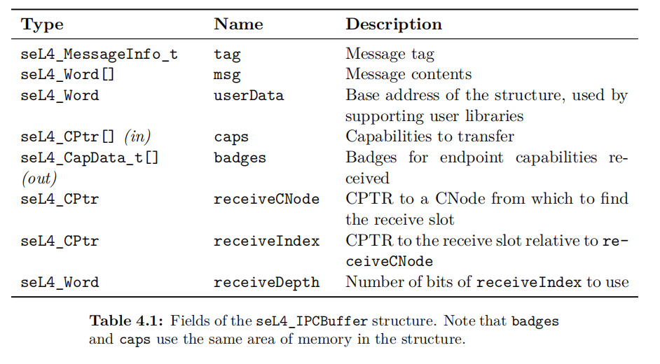

# endpoint/endpoint_cap

Endpoint_struct

```rust
block endpoint {
    field epQueue_head 64
    padding 16
    field_high epQueue_tail 46
    field state 2
}
```

Endpoint_cap

```rust
block endpoint_cap(capEPBadge, capCanGrantReply, capCanGrant, capCanSend,
                   capCanReceive, capEPPtr, capType) {
    field capEPBadge 64
    field capType 5
    field capCanGrantReply 1
    field capCanGrant 1
    field capCanReceive 1
    field capCanSend 1
    padding 7
    field_high capEPPtr 48
}
```


# 内核涉及endpoint的函数

## handleInvocation

- cap寻址
- 找到ipc_buffer

```c
decodeInvocation(seL4_MessageInfo_get_label(info), length,
                              cptr, lu_ret.slot, lu_ret.cap,
                              current_extra_caps, isBlocking, isCall,
                              buffer);
```

## decodeInvocation

- 根据cap类型选择调用的函数
- 从ep cap中拿到ep_struct地址，badge，cangrant，canGrantReply

## performInvocation_Endpoint

```c
/*Z 引用cap_endpoint_cap能力的系统调用：发送IPC及extraCaps给EP队列第1个接收者 */
exception_t performInvocation_Endpoint(endpoint_t *ep, word_t badge,/*Z 能力的EP指针、标记 */
                                       bool_t canGrant, bool_t canGrantReply,/*Z 能力的2个字段 */
                                       bool_t block, bool_t call)/*Z 是否阻塞、是否Call调用 */
{
    sendIPC(block, call, badge, canGrant, canGrantReply, NODE_STATE(ksCurThread), ep);

    return EXCEPTION_NONE;
}
```

在sendIPC中查询ep的状态

阻塞：Send/Call｜非阻塞：NBSend

- idle or send 且 非阻塞
  - 无事发生
  
- idle or send 且 阻塞
  - 进行一系列阻塞操作
  
    ```
    /*Z 线程状态，数据结构是struct{u64[3]}     阻塞的IPC对象可能有EP、NF、reply指针
        u64[0]  47              4         3  0
                阻塞的IPC对象指针         状态
        u64[1]        3                 2                1            0
                能否授权别人   能否授权别人回复    是否需回复    是否在ready/release队列
        u64[2]  标记
    */
    ```
  
    - 阻塞操作：在tcb的tcbState中设置上述字段的值为本ep，状态为ThreadState_BlockedOnSend
  
  - 将本线程tcb插入ep的等待队列
  
    ```c
    queue = ep_ptr_get_queue(epptr);/*Z 获取EP指针指向的队列头、尾 */
    queue = tcbEPAppend(thread, queue);/*Z 将线程加入到队列 */
    endpoint_ptr_set_state(epptr, EPState_Send);/*Z 设置EP指针的队列状态 */
    ep_ptr_set_queue(epptr, queue);/*Z 设置EP指针的队列头尾 */
    ```
  
- recv
  - 从等待队列中取出一个线程，这一步拿到dest的tcb
  
  - 调用`doIPCTransfer` 将消息发送给接收线程
  
    - 消息包括，所有的MRs，extracaps，badge，一集tcb中的ipc_buffer
    - 消息发送的方法：拿到sender receiver的tcb后直接复制
  
    ```c
    /*Z 根据sender的指示消息，将发送者的消息(及授予的能力或标记)copy给接收者 */
    void doNormalTransfer(tcb_t *sender, word_t *sendBuffer, endpoint_t *endpoint,
                          word_t badge, bool_t canGrant, tcb_t *receiver,
                          word_t *receiveBuffer)
    ```
  
  - 设置接受线程状态，`ThreadState_Running`
  
  - 如果是call类型的syscall：`setupCallerCap(thread, dest, replyCanGrant);*/\*Z 设置发送者为阻塞于接收回复状态，为接收者创建拷贝指向发送者的回复能力 \*/*`

### handleRecv

- SysRecv、SysReplyRecv、SysNBRecv

## receive_ipc

- 先处理绑定的ntfn

- idle or recv 且 非阻塞
  - doNBRecvFailedTransfer(thread);
- idle or recv 且 阻塞
  - 进行一系列阻塞操作,将本线程tcb插入ep的等待队列,和send操作一致
- send
  - 从等待队列中取出一个线程，这一步拿到src的tcb
  - doIPCTransfer
  - sender是否为call
    - 是：`setupCallerCap(sender, thread, cap_endpoint_cap_get_capCanGrant(cap));`
    - 否：设置发送线程状态，`ThreadState_Running`

# 通信流程

- 进程A，进程B初始化时拿到同一个ep的cap
  - 进程创建时分配/capdl

- A执行seL4_Send，该函数从ipc buffer里面取出数据放到寄存器x2-x5里，并发起系统调用；

- 执行sendIPC函数，该函数判断endpoint的状态，此时为idle状态（还没有进程在endpoint处等待），且blocking为True。故将A挂载到endpoint的队列上，置endpoint的状态为send状态；

- B执行seL4_Recv，发起系统调用；

- 执行receiveIPC函数，该函数判断endpoint的状态，此时为send状态（说明进程需要的信息已经发出了）。从endpoint的队列取出A，读取发送的message和badge给B(doNormalTransfer->copyMRs)；

- 完成。

## tutorial

- 两个sender一个receiver
- 通过capdl，三个进程共享一个unbadged ep\
- receiver通过unbadged_cap接收到两个sender的信息(Call)，取出badge
- 通过mint创建新的badged_cap,seL4_Reply,把这个cap返给sender
- sender预先设定一个空的cte准备接收badged_cap，之后在unbadged_cap上call

## badge

- 多进程使用一个ep通信时使用badge区分每个进程
- 2sender，1receiver：2个sender的ep_cap拥有不同的badge，receiver可以区分
- badge通过code_mint来分配

## 消息格式

- ipc_buffer:



- seL4_MessageInfo_t

  ```c
  typedef struct seL4_MessageInfo {
        uint64_t words[1];} seL4_MessageInfo_t;
        u64[0]     63          12   11         9   8          7   6                   0
                    标签(错误类型)       打开能力位图   授权能力数量      消息长度(不含授权能力)
  block seL4_MessageInfo {
  		field label 52
      field capsUnwrapped 3
      field extraCaps 2
      field length 7
  }
  ```
  
  

# 设计

## seL4 endpoint的申请/使用

- syscall流程
- 消息如何传递

## seL4 endpoint与Theseus的channel

- 消息传递：seL4消息通过ipc_buffer传递(拥有ep_cap的每个thread都有自己的buffer)，Theseus中的channel实体包含一个共享的buffer`queue: MpmcQueue<T>`
- 通信方式：seL4，将消息存储于ipc_buffer，对cap进行syscall。Theseus：sender/receiver拥有`Sender(Arc<channel>)`，调用结构体方法send/receive
- ep申请：均由父task分配

## safeos endpoint 设计

- 没有syscall，省略syscall_handler流程
- 如何实现动态分配endpoint，以及taskA运行时申请的ep如何与taskB连接
  - A,B有共同父task，在task初始化时分配好
  - 若不同时间被初始化，如何连接？taskA创建后想要和mm通信


- ep功能和sel4一致
- 实体不一样，模块
  - 不同crate打包成一个地址空间
- mm有什么？cspace，权限
- 每个ocject实现trait
