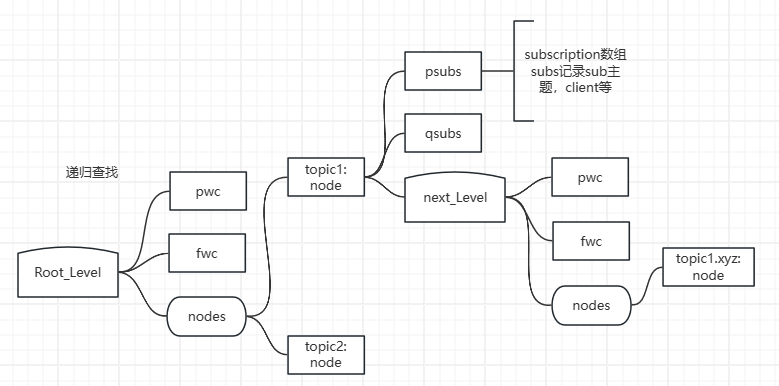
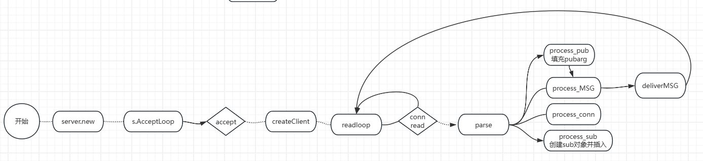

# 计划完成

- 调研NATS架构
- 调研sel4musllibc

# 实际完成

- 调研NATS实现机制

  - 基于递归的树形消息订阅树，按照队列名动态增加或释放树上节点

    

  - 基于状态机的快速文本解析架构->实现高吞吐量的重要因素

  - 熟悉NATS中服务器端如何处理发布，订阅消息队列

    

- 学习完整性度量要求的卸载机制所需的通信方法与协议，思考如何利用NATS的事件驱动架构实现高性能消息分发

  - NATS架构支持的三种通信模式符合计算核与安全核通信需求：发布-订阅，消息队列，请求-回复
  - 实现一个服务器线程，监听计算核发来的事件，并分发至安全核内订阅了相应事件队列的线程。使用和NATS同样的

- sel4musllibc仅支持21个系统调用，数量很少，没有实现价值。