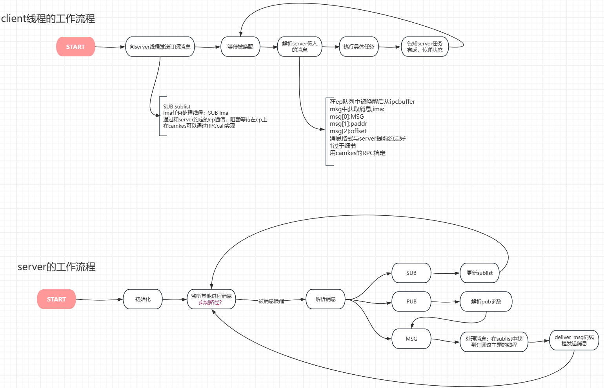

# 计划完成

- 阅读NATS client与server部分源码
- 设计asp处理高并发通信事件的模型框架

# 实际完成

- 了解mailbox的事件处理逻辑

  - 收到一个完整的任务请求
  - 以PUB/REQUEST的消息格式通过ep唤醒server
  - server创建一个线程处理这个问题

- 完成server与client端处理任务基本流程设计

  

- 对部分实现细节方面进行考量：

  - 除PUB/SUB类型的通信方式外，是否需要支持request/reply
  - 一个任务类型(sublist)是否只有一个线程订阅，相应的，队列组是否需要
  - server处理请求的方式：是否对到达的每个事件创建线程来处理

  - 线程间通信方面，可以组合使用RPC，dataport以及event
    - ntfn无法携带除badge外的额外信息，可以使用endpoint传递简单信息如物理地址，偏移量
    - ntfn的badge如何更好的使用？是否可以用badge代指订阅的队列名
  - sublist存储什么：初步考虑在sublist中存储sublist_name->cap(ep or ntfn)的map

# 待完成

- 了解camkes对用户app动态创建线程的支持情况
- server线程如何同时监听多个事件
- 上述实现细节的还待进一步思考与调研