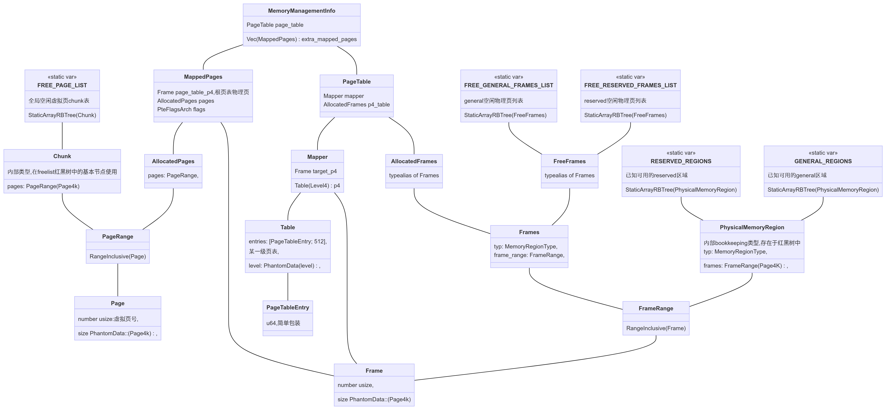
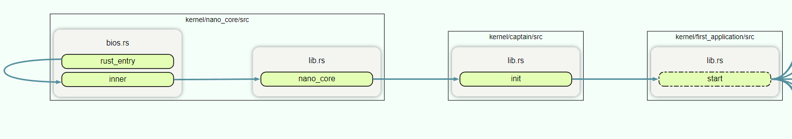

# 计划完成

- 调研Theseus的memory_management/heap/task管理

# 实际完成

## mm

- 代码部分由四个crate组成
  - memory_struct:macro实现基本内存类型(物理/虚拟地址，物理/虚拟页，物理/虚拟range)
  - page_allocator:管理空闲页，分配虚拟页
  - frame_allocator:管理并分配物理页
  - memory:管理页表，进行页映射，为与交互物理内存和申请内存提供接口

- 内存管理逻辑
  - page_allocator/frame_allocator提供`allocate`接口，分配`未映射`的物理和虚拟页
    - allocator内部维护红黑树，统计空闲的物理/虚拟页
  - memory为内存管理核心
    - MemoryManagementInfo维护一个页表和堆映射页面，所有task需要更改页表时获取其可变引用。
    - 页表暴露`map_allocated_pages()`方法，用来申请物理/虚拟页面并进行映射，返回MappedPages
    - MappedPages是与物理内存交互的唯一手段，堆栈内部均由MappedPages实现。MappedPages

​						结构体间依赖

## task

- 每个task拥有一个32页的栈空间，配备一个guard_page检测栈溢出

  - 实际运行时让task递归调用，会直接将系统卡死。栈溢出检测实现是否完善还有待调研

- boot工作由运行在nano_core&&captain的初始化task进行，该task会spawn一个terminal。

  

- task可以使用spawn生成另一个task，具体原理类似fork

## panic

- 调研core::alloc如何alloc与dealloc资源，在Theseus的heap实现底层依旧调用core中的函数
- rust::std在unwinding时清理栈上智能指针，指针指向的堆上资源如何释放？
  - Box<T>:仅有一个owner，智能指针释放时是否自动释放堆资源？如果是，那么是怎么做到的？
  - Arc/Rc:可以有多个索引，那么在资源回收的哪一步判断引用计数是否归零，如何进行具体资源释放？
