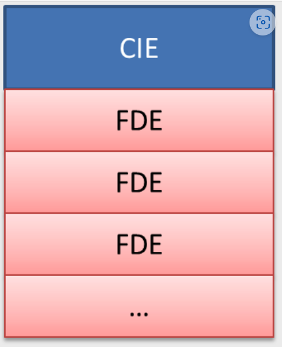
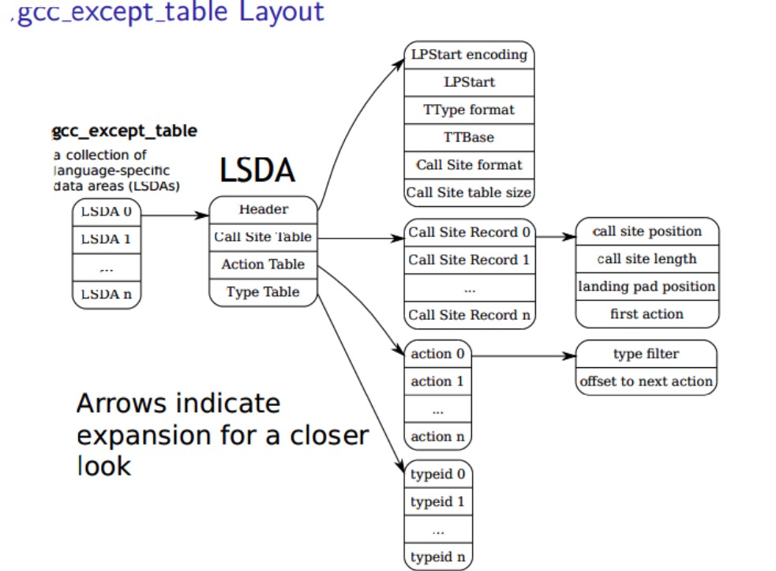

# 计划完成

- 实现unwind与backtrace

# 实际完成

- 完成简单的unwind与backtrace实现，在panic时通过stack unwind回收堆资源

## unwind框架

### 总体逻辑

- 保存现场(通用寄存器)
- 在eh_frame中找到RA所对应的fde项
- 根据fde项的augmentation data项定位LSDA(language specific data)
- LSDA存储于gcc_except_table中，解析LSDA，获得landing pad position
- 跳转至landing pad去执行资源释放代码
- 依据fde项中的call frame instructions 进行stack unwind，恢复上一级函数调用的现场，转到第一步执行

### 体系结构无关部分

elf文件中的三个不同section,配合在一起实现调用现场恢复并拿到landingpad，执行资源释放

#### eh_frame

- eh_frame由一个CIE (Common Information Entry) 及多个 FDE (Frame Description Entry)组成，它们在内存中是连续存放的

- 一个CIE对应多个FDE，每个FDE项包括一段pc范围以及CFIs。CFI遵循DWARF编码格式，指示pc范围内的每一个pc值所对应的寄存器值。
- fde项中可能有augmentation data，这一项指向lsda
- 同样，CIE中也可以有augmentation data,该data通常指向personality函数，该函数用于判断当前stack frame是否有lsda，若有，则代表有资源需要被清理，转去landing pad执行，若没有则返回

#### eh_frame_hdr

存放eh_frame header的表，可以加速fde查找(使用这个section查找fde时支持二分法)

#### gcc_except_table

- 这个table由lsda项组成，每个lsda项都包括诸多信息，unwinding时主要关注最右侧的landing pad position。该posiiton存储了一个内存地址，编译时编译器自动添加到lsda中去的。这个地址位于.text段中，指向rust compiler自动生成的资源回收(__rust_dealloc)代码，并通常以`__Unwind_Resume`函数调用结尾。
- unwinding时通过上述fde项定位到lsda后，解析lsda，拿到landing pad position(如果存在)是personality函数的主要工作

在代码层面，unwind主要依赖于一下几个函数。这些函数全部遵循C++ Itanium ABI

#### _Unwind_RaiseException

- unwind入口函数，将unwind分为phase1与phase2
- Phase1 进行backtrace，对每一级调用现场调用personality函数，查看是否为catchhandler(catch_unwind)。若找到则进入phase2
- phase2再从头回溯整个栈，负责定位fde，调用personality函数，调用landingpad，进行stack unwind恢复上一级调用栈直至catch_unwind

#### _Unwind_Resume

- landing pad指向的代码以调用该函数结尾，因此resume函数负责在phase2第一次跳转到landing pad(并不会返回到调用者)后将stackunwind继续下去。
- 具体来说：定位下一个fde，找到landingpad，转去执行
- 由于catch_unwind所在的那一级栈的landing pad不会以回到resume函数结尾，unwind将停在catch_unwind这里。至此，unwind流程全部结束

### 体系结构相关部分

在unwind中，只有恢复寄存器，在汇编级别进行跳转时的asm!代码为体系结构相关

### 在debug时发现并解决的问题&&更改的配置

- kernelstack大小由entry.S设置，不由start_rust.c设置的大小决定
- 链接器加入选项：--ehframe-hdr,加速fde查找,--gc-sections,丢掉多余的gcc_except_table项
- kernel.ld:加入gcc_except_table 与.eh_frame两个section
- rust-target：不能使用built-in的riscv64gc-unknown-elf。需要自己写一个json文件作为target
- cargo-build:增加如下选项`-Z build-std-features=compiler-builtins-mem -Z build-std=core,alloc  --target $(PWD)/riscv64-unknown-safeos.json`

