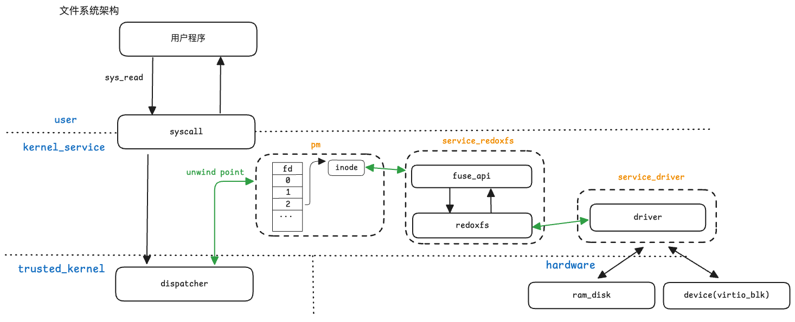

# 计划完成

- 调研redoxfs
- 移植redoxfs

# 实际完成

- 调研redoxfs实现逻辑
  - unsafe代码：需解决fs数据结构序列化问题，其余unsafe使用均已规避
  - 第三方库依赖：仅剩seahash一个依赖暂时无法去掉，且core中没有替代项。seahash作用是计算块数据的hash值，用来保证写入读出数据一致性
- 将redoxfs移植到safeos，并可以运行基本测试
  - redoxfs向下对接virtio-blk-driver，向上使用redox实现的标准fuse接口
  - 目前的测试就是调用fuse接口，目前支持create write和read

- safeos-文件系统架构：

其中：

- dispatcher和pm中的fd,inode待实现
  - dispather负责将标准的调用open/close/read/write分发给pm，进行类似linux vfs的工作，寻找到inode，再调用fuse接口操作redoxfs
- driver向下对接的ram_disk待实现

# 待完成

- 解决序列化unsafe问题
- 解决hash的第三方依赖
- 支持更多的fuse接口
- 将fuse接口与内核对接