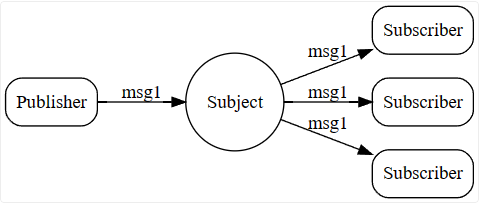
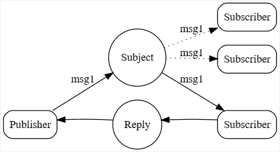
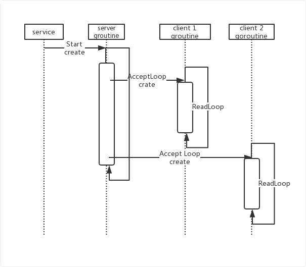
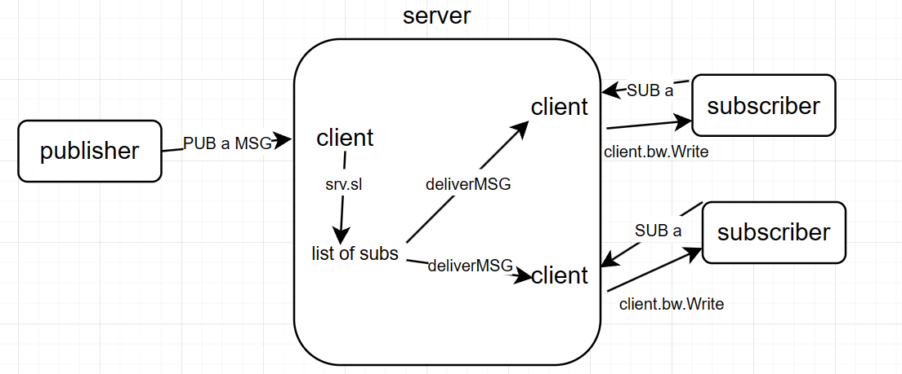

# NATS工作模式

## PUB/SUB

消息格式：

- nats sub <subject>
- nats pub <subject> <message>

```c
client1：nats sub msg.test
client2：nats sub msg.test
client3：nats pub msg.test "NATS MESSAGE 1"
client1和client2都会收到消息
```



## REQUEST/REPLY

带有回复能力的PUB/SUB

消息格式：

- nats reply <subject> <reply_message>
- nats request <subject> <request_message>

```c
client1:nats reply help.please 'OK, I CAN HELP!!!'//监听request
client2:nats request help.please 'I need help!'
```

- client1会收到以下消息

  ```c
  Received a request Message {
    subject: "help.please",
    reply: "_INBOX.moegqOEqmb5AGa0j8qAWHq.onCPPA7m4Kay8sMH5XDlSq",//用于向client2回复
    data: "I need help!"
  }
  ```

- client2会收到

  ```c
  Waiting on response for 'help.please'
  Response is Message {
    subject: "_INBOX.JbmI8rAMDevs2uDTv8nlfJ.dfdI5Dk8dNdcco3YoYFwxq",
    data: "OK, I CAN HELP!!!"
  }
  ```

### queue group

在上述例子中，nats为每一个reply请求添加一个默认的queue_group属性

server收到一个request请求，若发现订阅了该subject(help.please)的reply方从属于一个queue group，那么只会随机选择一个reply方传递消息并作出回复

```c
client1:nats reply help.please 'OK, I CAN HELP__1'
client2:nats reply help.please 'OK, I CAN HELP__2'
client3:nats request help.please 'I need help!'
```

client3会收到随机一个回复，client1&client2只有一个会收到client3的事件



# NATS事件驱动架构工作流程

## NATS server

- server.New()，实例化一个server类

  - server

    ```go
    type Server struct {
    	sl       *sublist.Sublist//存储订阅的字典树结构
        ... ...
    }
    ```

- AcceptLoop(),调用类方法

  - 循环监听`TCP连接请求`，接收到请求后创建一个client`(server.client)`处理请求

- createClient（）创建client实例，并创建goroutine，返回AcceptLoop继续监听

  - 创建client实例

    ```go
    type client struct {
    	cid  uint64//server的第n个client
    	bw   *bufio.Writer//写缓冲区
    	br   *bufio.Reader
        srv  *Server://连接的server的地址
    	subs *hashmap.HashMap//client本地的sublist存储[sid,sub]
        parseState //存储参数，如pubarg
    }
    ```

  - go c.readLoop()，创建goroutine，并发

- readLoop()

  - 循环监听`TCP连接上的事件`，对监听到的每个调用parse函数

- parse()使用状态机对事件进行解析，根据不同内容执行不同操作。`服务器端的解析只包含PUB和SUB两种，其他事件形式是PUB/SUB变体`

  - SUB：创建subscription实例并插入client本地subs与srv.sl

    ```go
    type subscription struct {
    	client  *client//当前工作流中的client
    	subject []byte//sublist名
    	queue   []byte//REQUEST/REPLY模式的参数，queue group
    	sid     []byte
    }
    ```
    
  - PUB:在srv.sl(字典树)中查找所有符合传入sublist的`subscription`实例，依次发送事件。`subscription`存有订阅方与server连接实例`client`的指针，通过访问该`client`的`client.bw.Write`方法传递事件。

    - processMSG：构建事件；deliverMSG：发送事件

- REQUEST/REPLY部分的特殊操作

  - processMSG时，在事件头加入reply属性

    ```go
    if c.pa.reply != nil {
    		mh = append(mh, c.pa.reply...)
    		mh = append(mh, ' ')
    	}
    ```

  - 若有queue_group，则随机选择(两个sub在同一个qsubs的前提是订阅同一个subject)

    ```go
    	if len(qsubs) > 0 {
    		index := rand.Int() % len(qsubs)
    		sub := qsubs[index]
    		mh := c.msgHeader(msgh[:si], sub)
    		sub.deliverMsg(mh, msg)
    	}
    ```


### NATS server 与 server.client



## NATS Client

- 与服务器建立连接

- 根据用户输入的命令执行相应操作,只向server发布PUB与SUB类事件

  - PUB：向server缓冲区写入要发布的事件，`"PUB {} {}\r\n", subj, msgb.len()`,事件与长度

  - SUB：简单的SUB操作不支持sub_queue,仅向server缓冲区写入事件
  
    - `"SUB {} {}\r\n", subject, sid`,订阅的subject和sid，sid自动生成
  
    - 返回client端的subscription对象
  
      ```rust
      pub struct Subscription {
          sid: usize,//订阅时生成
          recv: Receiver<Message>,//用于接收PUB事件
          subs: Arc<RwLock<HashMap<usize, Sender<Message>>>>,//订阅列表
          writer: Arc<Mutex<Outbound>>,//用于回复事件
      }
      ```
  
    - 监听recv，有事件传入执行相应操作
  
  - REQUEST：带有reply属性的PUB操作
  
    - reply属性是自动创建的sublist,`"_INBOX.{}.{}"`
    - 订阅该subject，`self.subscribe(&reply)`
    - `"PUB {} {} {}\r\n", subj, reply, msgb.len()`,事件，reply与长度
  
  - REPLY：带有queue属性的SUB操作
  
    - 存储用户预先设置的回复文本:`resp`
    - 同SUB操作一致，在向server发送订阅事件，多一个queue参数：`"SUB {} {} {}\r\n", subject,queue,sid`
    - 监听recv，等待事件传入，
    - 调用`respond`函数向request的client发送`resp`,发送的sublist为request_client生成的reply，

## NATS工作流程



# Cantrip事件驱动框架设计

## 思考


## 设计


- nats的server端会为每一个client的连接创建一个goroutine(轻量级线程)；cantrip中一个connection对应一个interfacethread.
- mailbox发送消息，经由server解析并分发给完成具体任务的线程，任务完成后线程发送消息，经由server传递给mailbox
- client向server通信，使用一个多对一的通信(RPCCall),由server提供
  - from-clients to-server，多生产者，单消费者
  - server使用状态机处理请求
    - SUB：更新sublist
    - PUB：查找订阅sublist的线程，并转发消息
  - server收到消息，解析出目的component，直接转发
    - 以ima为例，server收到mailbox发来的`PUB ima MSG`消息，直接使用`rpc_basic_send!(ima,...)`即可传递消息，ima为camkes中声明的conection
- server向client通信，一对一通信，由client提供，camkes中声明的
  - client负责通信的interfacethread调用rpc_basic_recv
  - server在解析到PUB消息时向对应的client调用rpc_basic_send，以预先约定的格式传递信息
  - client.interfacethread收到消息后执行任务，任务完成后发送消息给server

- PUB或SUB的消息由rpc_basic_buffer传递
