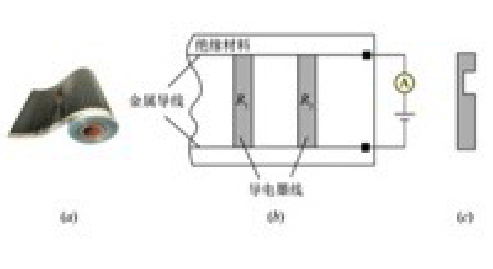
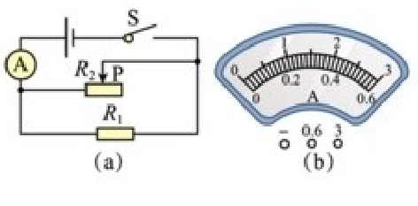
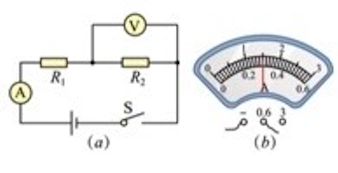
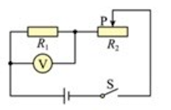
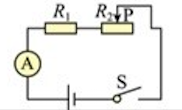

# 2024 学年第一学期九年级物理C层电学计算专题复习

## 1.如图所示是某物理小制作小组同学设计的身高测量仪的简易电路图。电源电压为6伏，R0为定值电阻。闭合开关，测得并记录部分数据见下表：

|  身高h/厘米   | 160  | 165  | 170  | 175  | 180  |
| :-----------: | :--: | :--: | :--: | :--: | :--: |
| 电压表示数/伏 | 0.0  | 2.0  | ...  | 3.6  | 4.0  |
| 电流表示数/安 | 0.3  | ...  | ...  | ...  | ...  |

（1） 计算定值电阻 R~0~的阻值：

（2）计算身高180厘米的同学测量时滑动变阻器接入电路的阻值R~p~：

（3）请说明$R_0 $在电路中的作用:_______

（4）甲、乙两同学经过讨论后认为可以用图像法处理数据，并对绘制的 $ h-P_u $ 图像作出不同的猜想。，如图所示，其中正确的是图」（选填“甲”或“乙”）。

（5）当身高为170厘米的同学测量时电压表的示数为___伏。

## 2.低溫碳纤维电热膜是一种发热效率高的新型电热元器件，常用于地板供暖。如图（a）所示，电热膜是运用特珠工艺在绝缘材料表面注入一根根导电墨线，导电墨线两消与金属导线相逢，形成网状结构。现裁取一段电热膜接入电路进行分析研究，其中包含2根导电墨线，如图（b）所示，每根导电累线的电阻均为60欧。

1. 若电源电压为12V，求通过导电墨线R~1~的电流I~1~：
2. 若电源电压不变，导电累线R，的一部分导电材料脱落，如图（c）所示，请简要说明电流表示数如何变化及变化的原因：
3. 若为保证电路安全，金属导线上承载电流不能超过0.5A。当用电阻为20欧的导电墨线R~3~替换R~2~时，必须同时调节电源电压大小，求调节后电源电压的最大值U 。

## 3.（2022.上海长宁一模）如图（a）所示的电路，电源电压为10V且不变，电阻R~1~的阻值为20欧，滑动变阻器R~2~标有 “20欧 2安”字样，电流表的表盘如图（b）所示，闭合开关S，电流表的示致为1.5安。求：

（1）通过电阻R~1~的电流I~1~：

（2）滑动变阻器的阻值R~2~：

（3）移动滑动变阻器滑片P的过程中，电流表示数的最大值I~max~ 和最小值I~min~.

## 4.在图（a）所示的电路中，电源电压为6V且保持不变，其中R~2~的阻值为15欧，闭合开关S，电流表示数如图（b）所示。

1. 求R~2~两端的电压。
2. 求R~1~的阻值。
3. 各电表量程不变，现用变阻器R~0~ 替換电阻 R~1~、R~2~ 中的一个后，闭合开关S，在确保电路中各元件正常工作的前提下，移动变阻器滑片，电压表示数的最大变化量为4伏。请判断变阻器R~0~替换的电阻，并求出 R~0~的最大阻值。

## 5.在图所示的电路中，电阻R~1~的阻值为10欧，滑动变阻器R~2~的最大阻值为2R，滑片P位于变阻器R~2~的中点（即连入电路的阻值为R）。闭合开关S后，电压表示数为U~0~

（1）若电压表示数U~0~为3伏，R~2~阻值为25欧，求通过R~1~的电流I~1~和电源电压U：

（2）若保持滑片P的位置不动，用一阻值为20欧的电阻R~0~替换R~1~，为使闭合开关后电原表示数仍为U~0~，小嘉认为可通过改变电源电压的方法实现。你觉得可行吗？请说明理由。若不可行，请写出其他的方法：若可行，请计算电源电压U ”（結果用U~0~ ,R表示）。

## 6.在图所示的电路中，电源电压保持不变，电阻R~1~的阻值为12 欧，滑动变阻器R~2~标有“100欧一安”字样。闭合开关S，移动滑片P至某位置时，电流表示数为0.5安。

（1）求此时电阻 R~1~ 两端的电压U~1~：

（2）现将一个电压表正确接入电路。闭合开关S，移动滑片P，在电路安全工作的情况下，电压表示数的变化泡围为6伏~15伏：

​	（a） 请指出电压表接入的位置，并说明理由

​	（b）求最小电流I~最小~。

